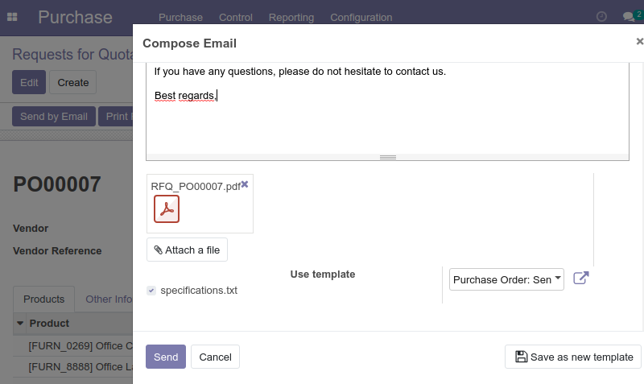

.. image:: https://img.shields.io/badge/licence-AGPL--3-blue.svg
    :alt: License: AGPL-3

Mail Attach Existing Attachment
===============================

This module was written to add the possibility to add attachments located on 
the object by sending it by email with the mail compose message wizard

Installation
============

To install this module, you need to:

* Click on install

Usage
=====

To configure this module, you need to:

* Adding some attachments on an object 

.. figure:: static/description/attachment.png
   :alt: Attachment on purchase order

* Then, by sending the object via email, you can select the attachment added earlier

.. image:: https://odoo-community.org/website/image/ir.attachment/5784_f2813bd/datas
   :alt: Try me on Runbot
   :target: https://runbot.odoo-community.org/runbot/205/10.0

Known issues / Roadmap
======================

* The module only allows the addition of attachments linked to the object.

Bug Tracker
===========

Bugs are tracked on `GitHub Issues
<https://github.com/OCA/social/issues>`_. In case of trouble, please
check there if your issue has already been reported. If you spotted it first,
help us smashing it by providing a detailed and welcomed feedback.

Credits
=======

Contributors
------------

* Adrien Peiffer <adrien.peiffer@acsone.eu>
* Sergio Teruel <sergio.teruel@tecnativa.com>

Maintainer
----------

.. image:: http://odoo-community.org/logo.png
   :alt: Odoo Community Association
   :target: http://odoo-community.org

This module is maintained by the OCA.

OCA, or the Odoo Community Association, is a nonprofit organization whose mission is to support the collaborative development of Odoo features and promote its widespread use.

To contribute to this module, please visit http://odoo-community.org.
