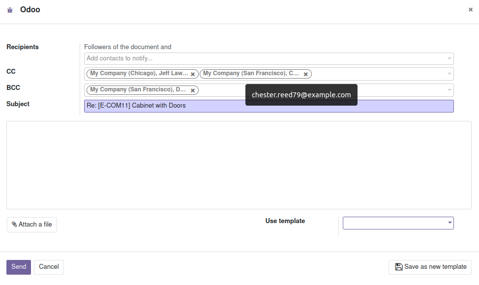
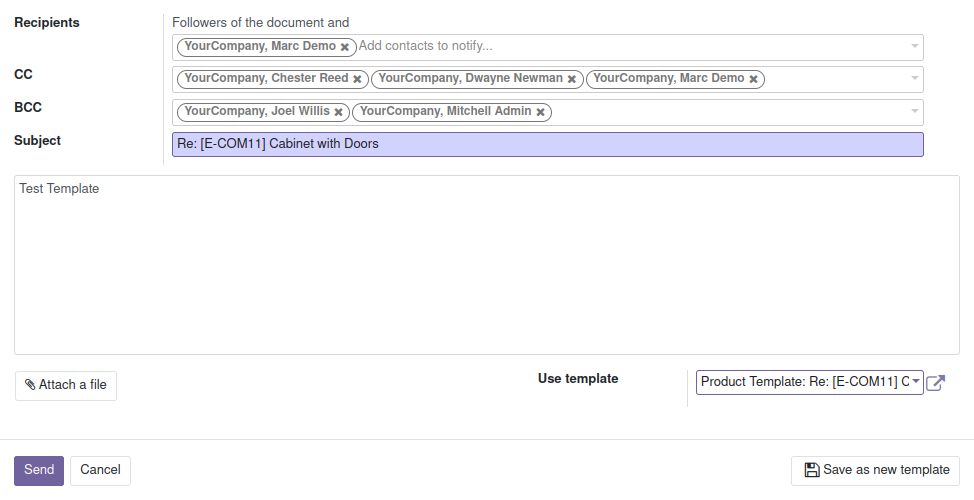

The partners cc and bcc from company form will be used to fill in mail
composer form.

> 

When select a template that has cc and/or bcc emails, the emails will be
used to lookup partners then found partners will be added to
corresponding mail composer's fields.

> 
