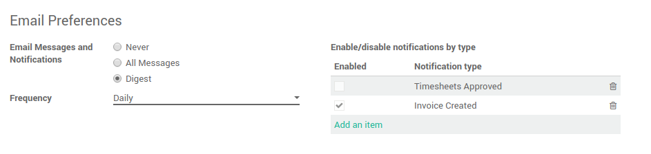

.. image:: https://img.shields.io/badge/licence-AGPL--3-blue.svg
   :target: http://www.gnu.org/licenses/agpl-3.0-standalone.html
   :alt: License: AGPL-3

=========================
Mail digest notifications
=========================

Features
--------

This module allows users/partners to:

* select "digest" mode in their notification settings
* with digest mode on select a frequency: "daily" or "weekly"
* configure specific rules per message subtype (enabled/disabled)

to receive or to not receive any email notification for a given subtype.

The preference tab on user's form will look like:

Behavior
--------

When a partner with digest mode on is notified with a message of type email or an email
all the messages are collected inside a `mail.digest` container.

A daily cron and a weekly cron will take care of creating a single email per each digest,
which will be sent as a standard email.

If the message has a specific subtype, all of this will work only
if personal settings allow to receive notification for that specific subtype.
Specifically:

* no record for type: message passes
* record disabled for type: message don't pass
* record enabled for type: message pass

NOTE: under the hood the digest notification logic excludes followers to be notified,
since you really want to notify only mail.digest's partner.

Known issues / Roadmap
======================

* take full control of message and email template.

Right now the notification message and the digest mail itself is wrapped inside Odoo mail template.
We should be able to customize this easily.

Bug Tracker
===========

Bugs are tracked on `GitHub Issues
<https://github.com/OCA/social/issues>`_. In case of trouble, please
check there if your issue has already been reported. If you spotted it first,
help us smashing it by providing a detailed and welcomed feedback.

Credits
=======

Contributors
------------

* Simone Orsi <simone.orsi@camptocamp.com>

Funders
-------

The development of this module has been financially supported by: `Fluxdock.io <https://fluxdock.io>`_

Maintainer
----------

.. image:: https://odoo-community.org/logo.png
   :alt: Odoo Community Association
   :target: https://odoo-community.org

This module is maintained by the OCA.

OCA, or the Odoo Community Association, is a nonprofit organization whose
mission is to support the collaborative development of Odoo features and
promote its widespread use.

To contribute to this module, please visit https://odoo-community.org.
