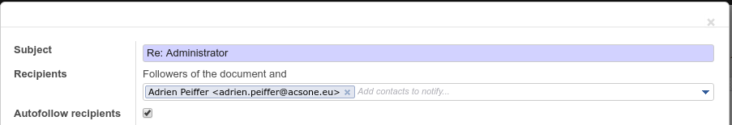

.. image:: https://img.shields.io/badge/license-AGPL--3-blue.png
   :target: https://www.gnu.org/licenses/agpl
   :alt: License: AGPL-3

========================
Mail optional autofollow
========================

This module adds the possibility to choose if you want to automatically
add new recipients as followers on mail.compose.message.

Installation
============

Configuration
=============

Usage
=====

To use this module, you need to use the autofollow recipients checkbox on
mail.compose.message:

Technically, this field is initialized to true if there is a
'mail_post_autofollow' key in the current context 

.. image:: https://odoo-community.org/website/image/ir.attachment/5784_f2813bd/datas
   :alt: Try me on Runbot
   :target: https://runbot.odoo-community.org/runbot/205/11.0

Known issues / Roadmap
======================

Bug Tracker
===========

Bugs are tracked on `GitHub Issues
<https://github.com/OCA/social/issues>`_.In case of trouble, please check there
if your issue has already been reported. If you spotted it first, help us
smashing it by providing a detailed and welcomed feedback
`here <https://github.com/OCA/social/issues/new?body=module:%20mail_optional_autofollow%0Aversion:%2011.0%0A%0A**Steps%20to%20reproduce**%0A-%20...%0A%0A**Current%20behavior**%0A%0A**Expected%20behavior**>`_.

Credits
=======

Images
------

* Odoo Community Association: `Icon <https://odoo-community.org/logo.png>`_.

Contributors
------------

* Adrien Peiffer <adrien.peiffer@acsone.eu>
* Stéphane Bidoul <stephane.bidoul@acsone.eu>

Do not contact contributors directly about support or help with technical issues.

Funders
-------

The development of this module has been financially supported by:

* Acsone

Maintainer
----------

.. image:: https://odoo-community.org/logo.png
   :alt: Odoo Community Association
   :target: https://odoo-community.org

This module is maintained by the OCA.

OCA, or the Odoo Community Association, is a nonprofit organization whose
mission is to support the collaborative development of Odoo features and
promote its widespread use.

To contribute to this module, please visit https://odoo-community.org.
