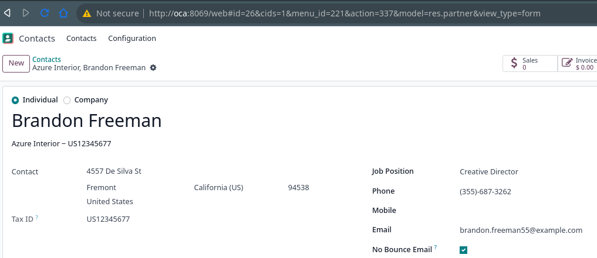
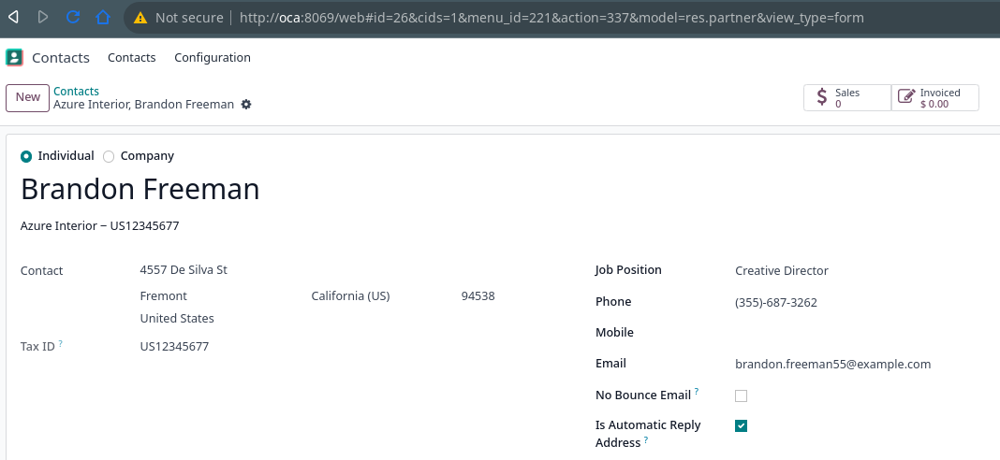

To never send a bounce email to a specific email address, you can tick
no_bounce_email as below:

To never send email notification when receiving auto-reply email from a
specific email address identified as an auto-reply address, you can tick is_automatic_reply_address as
below:

