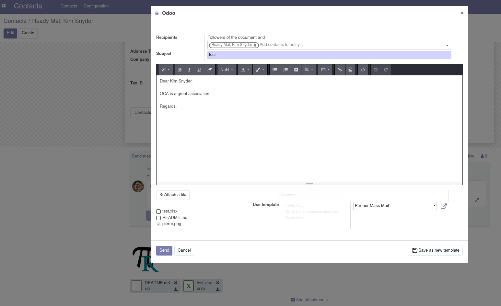

To use this module, you need to:

* Adding some attachments on an object

.. figure:: ../static/description/attachment.png
   :alt: Attachment on res partner

* Then, by sending the object via email, you can see existing attachment
  matching the regex are selected by default from chosen configured template

---

Using in mass mailing existing attachements matching configured regex
will be part of the mail.
