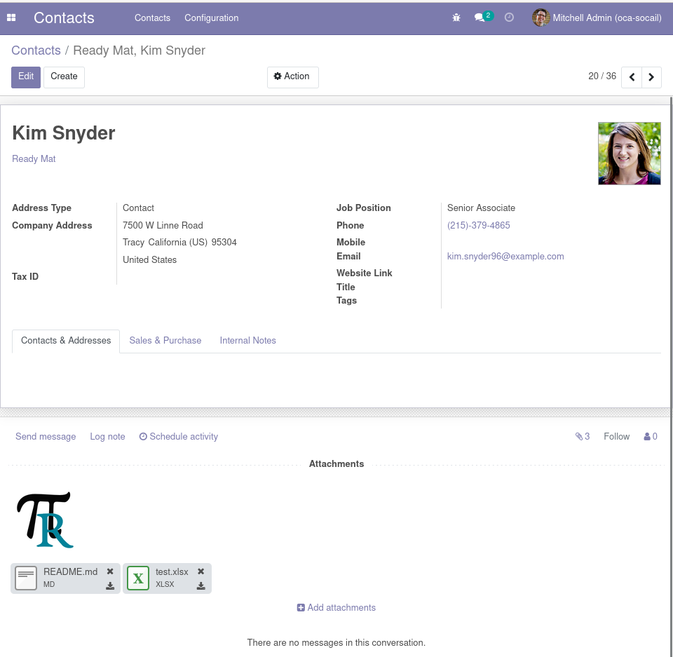

To use this module, you need to:

* Adding some attachments on an object

* Then, by sending the object via email, you can see existing attachment
  matching the regex are selected by default from chosen configured template

.. figure:: ../static/description/mail_compose_message.png
   :alt: Sends the partner message

---

Using in mass mailing existing attachements matching configured regex
will be part of the mail.
