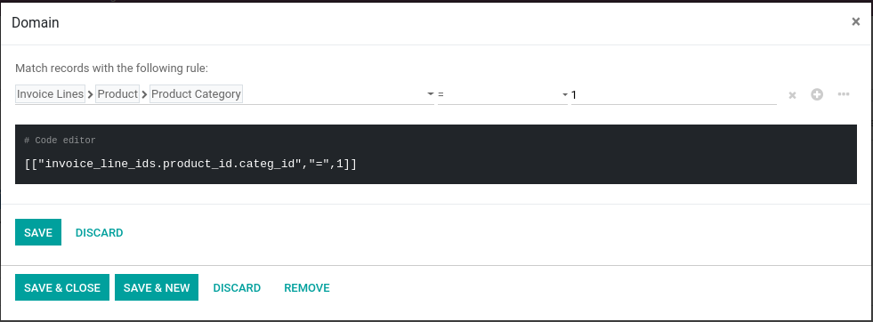

1. Go to the corresponding Email Template record.
2. You should see the Conditional Attachments under Advance Settings
3. Create a new conditional attachment, and select the domain condition.

You can attach multiple files under the same condition.

