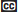
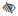
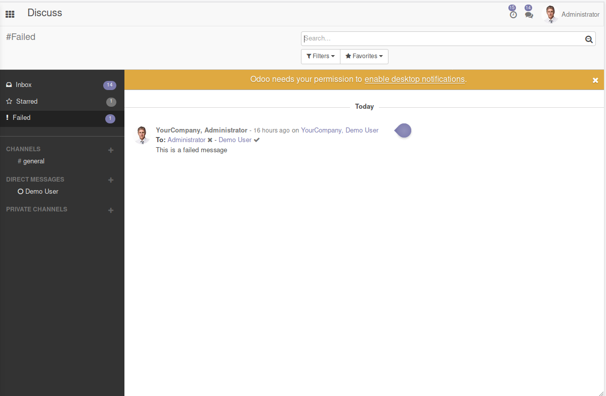
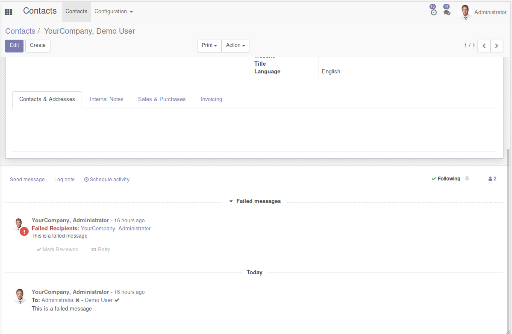
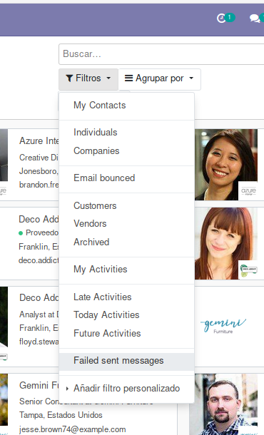

When user sends a message in mail_thread (chatter), for instance in
partner form, then an email tracking is created for each email
notification. Then a status icon will appear just right to name of
notified partner.

These are all available status icons:

 **Unknown**: No email tracking
info available. Maybe this notified partner has 'Receive Inbox
Notifications by Email' == 'Never'

 **Waiting**: Waiting to be
sent

 **Error**: Error while sending

 **Sent**: Sent to SMTP server
configured

 **Delivered**: Delivered
to final MX server

 **Opened**: Opened by partner

 **Cc**: It's a Carbon-Copy recipient.
Can't know the status so is 'Unknown'

 **No Email**: The partner
doesn't have a defined email

 **No Partner**: The
recipient doesn't have a defined partner

If you want to see all tracking emails and events you can go to

- Settings \> Technical \> Email \> Tracking emails
- Settings \> Technical \> Email \> Tracking events

When the message generates an 'error' status, it will apear on discuss
'Failed' channel. Any view with chatter can show the failed messages
too.

- Discuss

  

- Chatter

  

You can use "Failed sent messages" filter present in all views to show
records with messages in failed status and that needs an user action.

- Filter

  
