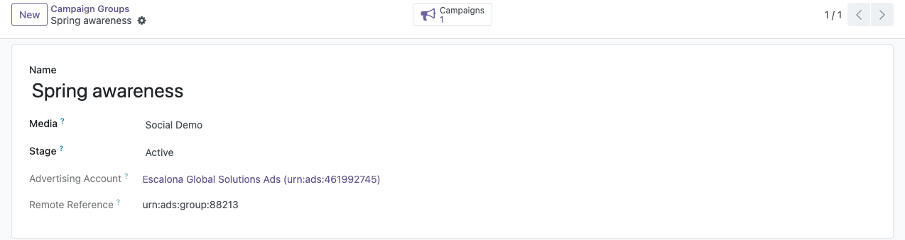
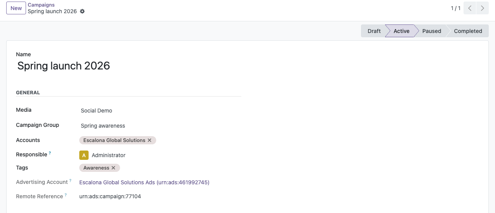
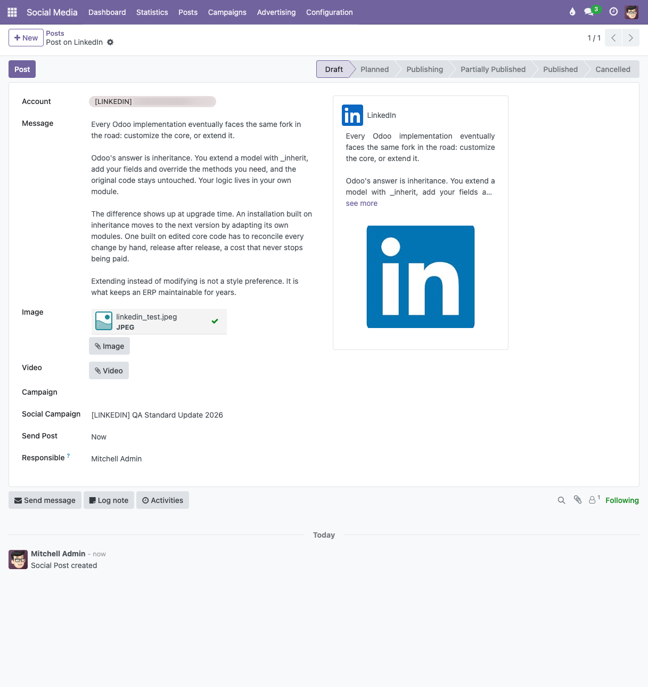
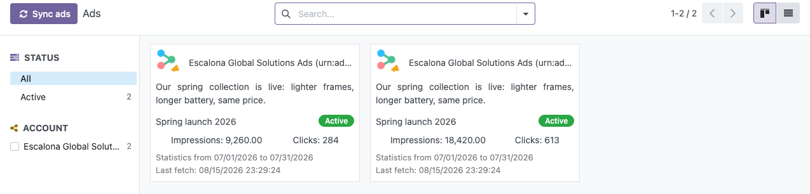

Choose the advertising account.
---------------

- Go to *Social Media* > Configuration > Accounts, open an account and its
  *Advertising* tab.
- Click *Fetch advertising accounts*. The advertising accounts the authorized
  member may reach are brought from the social media and listed read-only:
  they mirror the social media and are never pushed back.
- Only the advertising accounts of the current environment can be used, so
  check the *Environment* first.
- Click *Use this account* on the row you want the campaigns and the ads to
  belong to. It is highlighted and marked *In Use*, and any other one is
  unmarked: **one advertising account at a time per social media account**.
- **Nothing works until one is marked.** When the environment leaves exactly
  one candidate, it is marked *In Use* automatically, both when the
  advertising accounts are fetched and when the environment changes. With
  several candidates none is chosen and you have to pick one: campaigns,
  campaign groups and ads all belong to a single advertising account on the
  social media, so guessing one would silently work against the wrong advertiser.
  A choice already made is never replaced. While none is in use, importing
  and creating campaigns is refused with a message saying so, and no ad is
  fetched.
- Fetching again refreshes the list without changing your choice. An
  advertising account that no longer exists on the social media is dropped
  from the list, unless the social media returns no account at all: in that
  case nothing is removed, because an empty answer cannot be told apart from a
  temporary failure.
- Go to *Social Media* > Advertising > `<social media>` > Ad accounts for
  the list of the advertising accounts of that social media, with filters by
  environment and by the one in use. Open one to see its details and its
  *Campaigns* and *Campaign Groups* stat buttons.
- A campaign and a campaign group record the advertising account they belong
  to when they are created on the social media or imported from it, and it
  never changes afterwards, except when the advertising account itself
  disappears from the social media on a *Fetch advertising accounts*: it is
  then dropped and the campaigns and the campaign groups are left without a
  link. Choosing another advertising account therefore
  does not move the campaigns already created: the stat buttons keep showing
  the history as it happened. A campaign or a campaign group holding no
  advertising account is linked on the next *Fetch campaigns*.

Stat buttons of the account.
---------------

- Go to *Social Media* > Configuration > Accounts and open an account.
- *Campaigns* and *Campaign Groups* cover every advertising account of the
  social media account, not only the one in use.
- *Ads* opens the ads of that account with the standard search bar, so they
  can still be filtered by date, grouped and saved as a favourite.
- All three are only shown for a social media whose connector module manages
  advertising. The *Marketing Campaigns* button next to them comes from
  *Social Media Base* and is always shown: a marketing campaign needs no
  advertising connector.

Generate a campaign group.
---------------

- Go to *Social Media* > Advertising > `<social media>` > Campaign group > New
- A form view opens; fill in the required fields
  
- Save
- The *Campaigns* stat button on the form shows the number of campaigns of
  the group and navigates to them.

Generate a campaign.
---------------

- Go to *Social Media* > Advertising > `<social media>` > Campaigns > New
- Fill in the fields. The social media is optional; when a social media is
  selected, the campaign group and the accounts become required.
  
- Save
- Changes on the main campaign fields are logged in the chatter.
- A campaign can target several accounts of the same social media. A
  connector module may restrict it: LinkedIn campaigns accept a single
  account, because the campaign belongs to one advertising account there.

Campaign and campaign group stages.
---------------

- The status bar of the campaign form and the *Stage* field of the campaign
  group show the status the social media gives to the record.
- Only the stages of the social media selected on the campaign are offered,
  and only those whose *Applies To* matches the record.
- The stages are declared by each connector module, see the configuration
  section.

Link the campaigns to a post.
---------------

A post carries two independent campaigns, and both are optional:

- *Campaign* is the Odoo marketing campaign (`utm.campaign`), the same one
  used by the mailings, the leads and the UTM tracking. Any of them can be
  selected.
- *Social campaign* is the campaign of the social media, the one holding
  the budget, the campaign group and the reference used to publish a
  sponsored post. Only social campaigns whose social media matches the
  accounts selected on the post can be chosen. A connector module narrows
  the list further with the rules of its social media, so what is offered are the
  campaigns that can actually sponsor **this** post: see the LinkedIn ad
  formats in *Social Media Advertising LinkedIn*.
- Editing the content of the post can invalidate the social campaign already
  chosen. When that happens the field is cleared as soon as the content
  changes, instead of letting the post fail when it is published. Pick
  another campaign among the ones then offered.

Both are propagated to the publications of the post. A publication imported
from the social media keeps whatever its connector was able to resolve.

Both are frozen, like the rest of the content of the post, as soon as one of
its accounts publishes: they decide how the post goes out, so changing them
afterwards would no longer describe what is online.

  

Ads.
---------------

- Go to *Social Media* > Advertising > `<social media>` > Ads
- The view is empty until the first synchronization. The *Sync ads* button
  brings the sponsored creatives of every account the user is responsible
  for, and it is the only thing that does: the view shows the picture of
  the last synchronization, not what the social media serves right now.
  Each ad carries the moment it was last fetched.
- An ad is named after the text of the post it promotes, which is what it
  is recognized by. An ad promoting a post this database does not know is
  named *Post not available*.
- Every ad shows its status, its campaign, the publication it promotes and
  its statistics. The cards carry no image, so they all keep the same shape
  whether the promoted post has one or not: the images are shown on the
  publication, which the *Publication* button opens. The *Open ad* button
  opens the ad itself on the social media, not the campaign it belongs to. The status is the one set by the advertiser on the social
  media, with the name and the colour of the matching stage; the reason why
  the social media is serving the ad or not is only shown on the form of the
  ad.
- The statistics cover the window shown next to them. They are not the
  figures of the whole life of the ad.
- The search bar is the standard one: filter by creation date, group by
  account, advertising account, campaign or status, and save a favourite.
  The panel on the side filters by status and by account.
- Only the ads of the advertising account in use are fetched. The ones of
  the other advertising accounts stay as they were last synchronized and
  are marked *Advertising account not in use*; the *Advertising account in
  use* filter leaves them out.
- Deleting an account permanently takes with it what only that account
  could reach: its advertising accounts, its ads, and the campaigns and
  campaign groups that exist on the social media. What was written here and
  never published is kept, and only loses the account that is going away;
  so is a campaign shared with an account that stays, and a group that still
  holds a campaign of somebody else.
- An ad the social media stops answering is archived, never deleted: its
  statistics are the only trace left of what it did, and the connector
  leaves on it the status its social media gives a deleted ad. The
  *Delete permanently* button, reserved to the administrators and to the
  archived ads, is what removes that history from Odoo when it is not
  wanted; the confirmation says what is lost. Nothing is deleted on the
  social media, which no longer serves that ad anyway.
- The *Delete ad* button deletes the ad **on the social media**, not only in
  Odoo, and it cannot be undone. It is only shown for the social media whose
  connector deletes an ad, and only the responsible user of the account and
  the social media administrators may press it. What the social media answers
  decides what is left in Odoo: an ad the social media deletes on the spot
  loses its record here as well, along with its statistics, while one that
  is only taken for deletion keeps its record with the status the social media
  reports until it is processed.
- An ad the social media stops serving is archived, never deleted, so its
  statistics survive. Archiving an account archives its ads too; deleting it
  deletes them.
- A cron checks every six hours whether the social media serves ads this
  database does not know yet. No ad is fetched: it only raises a flag on the
  account. The responsible user gets a notice on the ads view, and the *New
  ads available* badge stays there across reloads until the ads are
  synchronized, so the user decides when to press *Sync ads*.

  

Fetch campaigns.
---------------

- The account form provides a *Fetch campaigns* button when the connector
  module adds it. Each social media module implements the actual import; a
  notification shows the result.
- The import can also link the publications already brought from the social
  media with the campaign they belong to, when the connector is able to
  resolve it.

Archiving.
---------------

- Archiving an account also archives its campaigns and their campaign groups.
- A campaign shared by several accounts is only archived when all of its
  accounts are, whether they are archived together or one by one, and a
  campaign group is only archived when it has no active campaign left.
- Unarchiving the account restores everything.
- Deleting an account permanently deletes the campaigns and the campaign
  groups that exist on the social media, the same way the *Delete* button of
  a campaign does. A campaign that was only written in Odoo and never reached
  the social media is kept, and it only loses the link to the account; a
  campaign group is kept as long as it still has a campaign.

Campaign ownership.
---------------

- Every campaign has a *Responsible* user, set to whoever created it. A
  regular user of the *Social Media / User: Own Accounts* group only sees the
  campaigns he is responsible for; the *Social Media / Administrator* group
  sees all of them.
