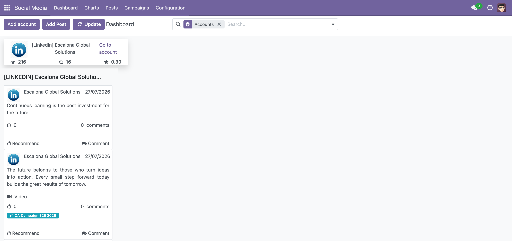
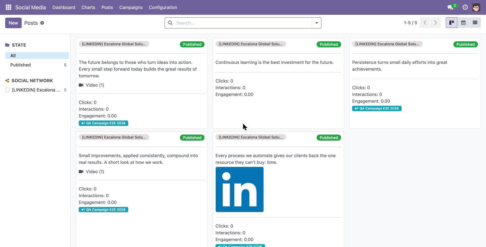
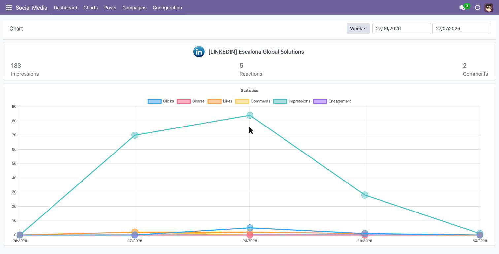
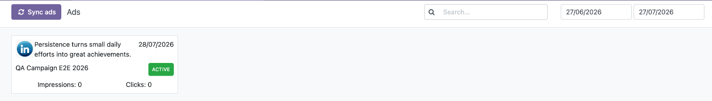
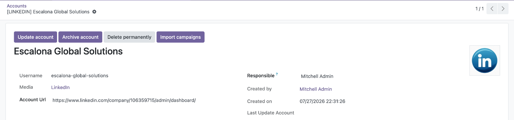

Generate group campaign.
---------------

- Go to *Social Media* > Campaigns > Campaign group > New
- A form view opens; fill in the required fields
  
- Save
- The *Campaigns* stat button on the form shows the number of campaigns of
  the group and navigates to them.

Generate campaign.
---------------

- Go to *Social Media* > Campaigns > Campaigns > New
- Fill in the fields. The social media is optional; when a social media is
  selected, the campaign group and the account become required.
  
- Save
- Changes on the main campaign fields are logged in the chatter.
- The native campaign stage bar is hidden in the Social Media views; the
  stages keep working in the other applications that use campaigns, where
  they can also be managed.

Link a campaign to a post.
---------------

- On the post form, select a campaign. Only campaigns whose social media
  matches the accounts selected on the post can be chosen.
- The campaign is shown as a badge on the post kanban and on the dashboard
  cards.

  

Posts on the dashboard.
---------------

- Posts that contain a video display a video indicator on their card, and
  the posts kanban shows a *Video (N)* counter.
- Posts deleted directly on the social network are marked as *Deleted on
  \<media\>* and kept in the dashboard as history.

  

Charts.
---------------

- Go to *Social Media* > Charts
- The view shows one chart per connected account with the statistics of its
  publications. The statistics are requested to the social networks when the
  view is opened, so a loader is displayed until they are available.

  

Ads.
---------------

- Go to *Social Media* > Campaigns > Ads
- The view lists the sponsored creatives of the connected accounts, each one
  with its status, its campaign and the post it promotes. Clicking an ad
  opens it on the social network.
- The status is the one set by the advertiser on the social network; the
  reason why the network is serving the ad or not is shown in the tooltip of
  the badge.
- The ads can be filtered by creation date and by text, which is searched in
  the campaign name, the post name and the status. The *Sync ads* button
  refreshes them from the social networks.

  

Archive an account.
---------------

- The account form provides an *Archive account* button, available to the
  user responsible for the account.

  

- Archiving an account also archives its dashboard posts, campaigns,
  campaign groups and the posts linked only to that account.
- Nothing is removed from the social network, and unarchiving the account
  restores everything.

Delete an account permanently.
---------------

- The account form provides a *Delete permanently* button, available only to
  the *Social Media / Administrator* group. A regular user can only archive
  his accounts, he is not allowed to delete them.
- It deletes the account, its dashboard publications and the posts that were
  linked only to that account, together with their metrics, comments and
  attachments.
- Campaigns and campaign groups are **not** deleted, they only lose their
  link to the account: campaigns are shared with the other Odoo applications
  and may be linked to leads, orders or mailings.
- Nothing is deleted from the social network: the publications stay online.
- This cannot be undone. To keep the history, archive the account instead.

Statistics synchronization.
---------------

- The scheduled action *Social: Sync posts statistics* updates the post
  statistics monthly.
- An initial synchronization is also triggered automatically right after an
  account is linked.

Import campaigns.
---------------

- The account form provides an *Import campaigns* button. Each social
  network module implements the actual import; a notification shows the
  result.

Account ownership.
---------------

- Every account has a *Responsible* user, set to whoever linked it. A regular
  user of the *Social Media / User: Own Accounts* group only sees and
  manages his own accounts, their posts, campaigns and statistics.
- Linking an account that already exists in Odoo (relinking it after
  archiving it, after reinstalling the connector or to renew its tokens) is
  restricted to that responsible user and to the *Social Media /
  Administrator* group, because it overwrites the credentials and the access
  tokens stored in the account.
- Accounts are recognised by the identifier they have on the social network,
  not by their name: renaming the account on the social network keeps the
  history in Odoo, and a name reused by a different account never overwrites
  an existing one.
- If another user completes the association of an account that is not his,
  nothing is written and a notification explains that the account belongs to
  somebody else. The same happens when the administrator of the wizard tries
  to change the credentials of an account that is not his.
- The *Update account* and *Archive account* buttons of the account form are
  shown to the responsible user and to the *Social Media / Administrator*
  group. The credentials themselves (client keys and tokens) stay hidden
  from everybody but the system administrators, and the connectors read and
  write them internally, so an administrator of the application can renew
  them without ever seeing them.

Campaign badge.
---------------

- The publications of the dashboard and of the posts kanban show the campaign
  they belong to as a badge. Long campaign names are shortened with an
  ellipsis so the card keeps its shape, and the whole name is available in
  the tooltip.
- Clicking the badge opens that campaign in Odoo, so its budget, its status
  on the social network and its history are one click away from the post.
