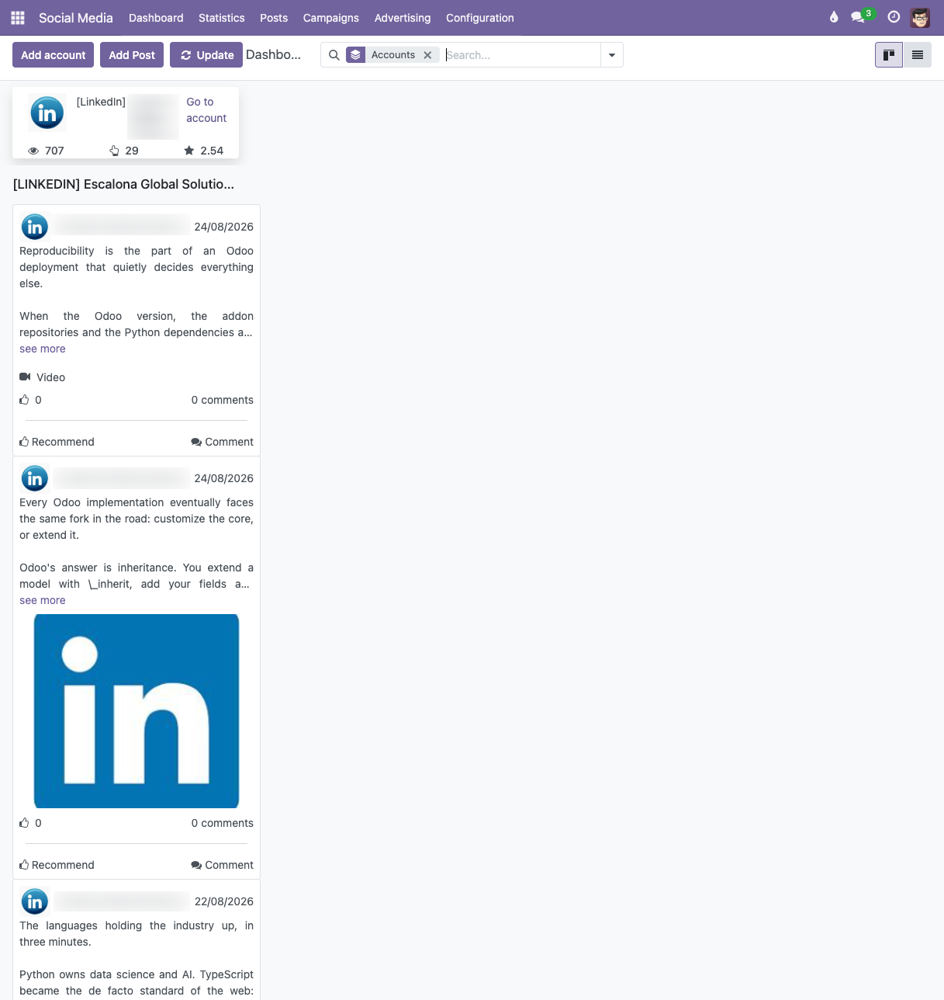
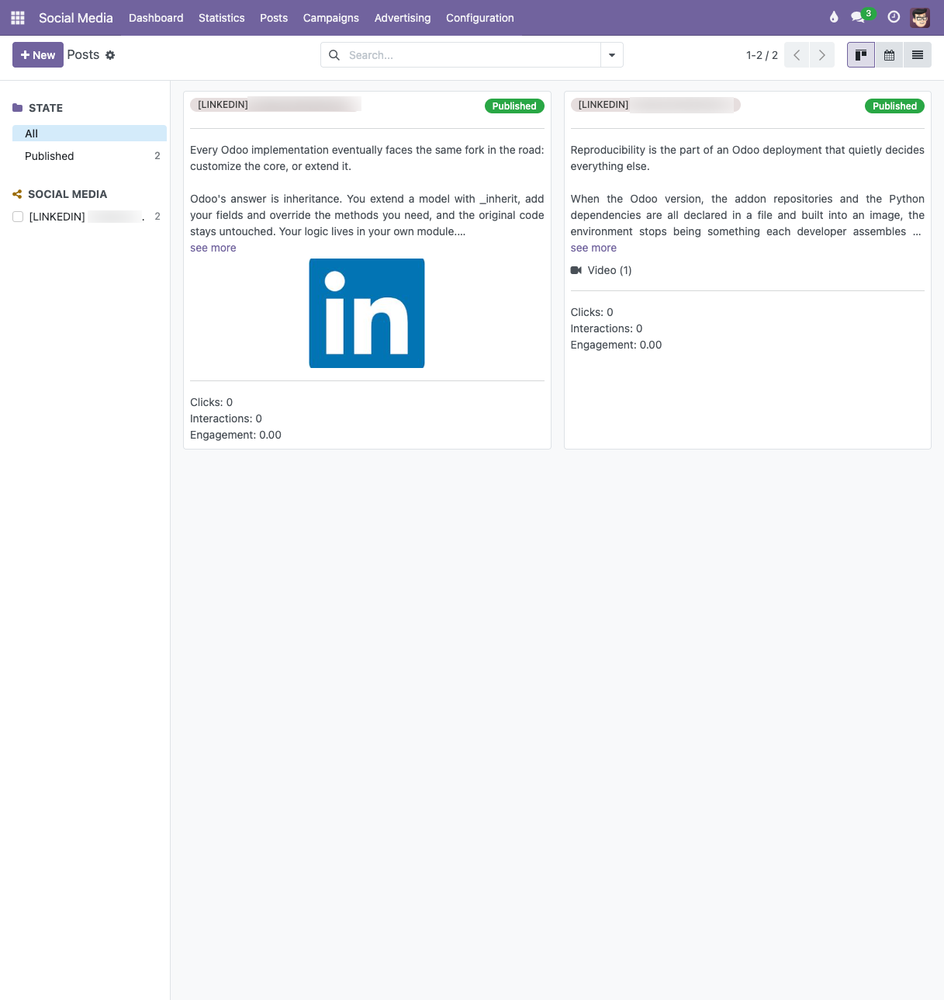
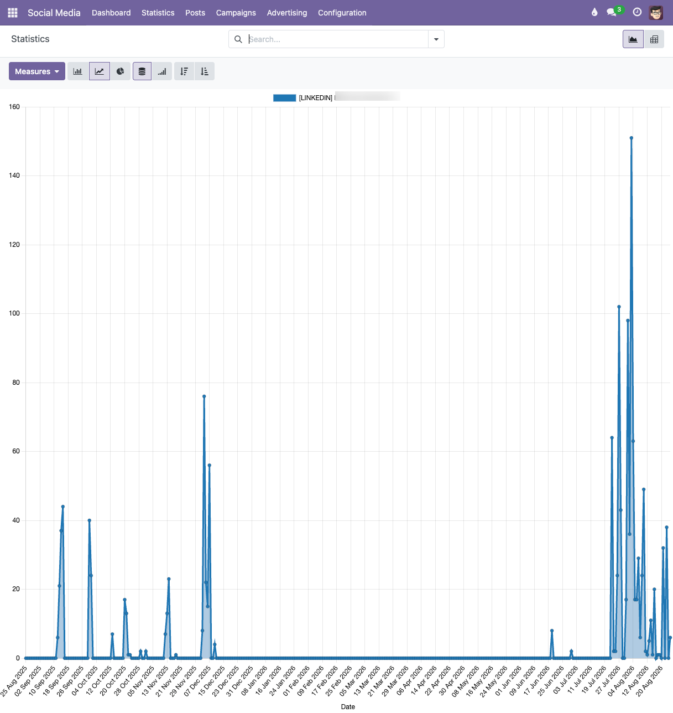
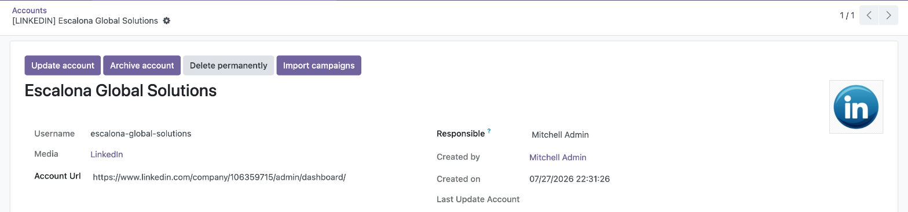

Posts on the dashboard.
---------------

- The header of the dashboard carries *Add account*, which opens the list of
  social media to link one, and *Add Post*, which opens a new post, next to
  the *Update* button.
- The dashboard lists the publications that exist on the social media,
  together with their statistics. A scheduled publication is not online yet
  and a failed one never got there, so neither of them is listed: they are
  followed from the *Posts* menu, on the post they belong to, and the
  scheduled ones also in the calendar.
- Posts that contain a video display a video indicator on their card, and
  the posts kanban shows a *Video (N)* counter.
- Opening a single publication shows it read-only, with its account, its
  state, its message, its images, its videos and its statistics. A
  publication mirrors the social media, so nothing is written from there.
  The *Open publication* button opens it on the social media, and is only
  shown for a publication that got there: one that was never published, or
  whose publication was deleted, has no address. The address survives a
  deletion made on the social media, so the button asks before opening
  anything: one call, for the one publication being opened. The card of the
  dashboard asks the same way.
- A publication carries the very images and videos of its post. The post hands
  them over when it is sent, so a card shows them as soon as the publication
  exists — one that failed shows them just like one that went through — and a
  picture sent to several accounts is stored once, not once per account.
- A publication imported from the social media is the only one that keeps
  medias of its own, because it has no post to share them with. It carries
  the video itself when the module that imports it downloads it. Otherwise it
  only carries the flag saying it has a video, and the video is watched on the
  social media.
- Posts deleted directly on the social media are marked as *Deleted on
  \<media\>* and kept in the dashboard as history. Opening one is what
  notices it here. Finding out on its own, without anybody opening anything,
  means reading the whole feed: that pass comes with *Social Media Sync*.
- Commenting a publication, answering a comment and *Recommend* are read from
  and written to the social media, so they come with *Social Media Sync*.
  Without that module the card shows neither the counters nor the entries:
  the footer of a card in this module carries only the campaign badge. Both
  the like and comment counters and the entries that write them come with
  that module, and only for a social media whose bridge serves them.
- Deleting a post deletes the publications it created. A post whose
  publications are still online cannot be deleted: remove them from the
  dashboard first, which deletes them on the social media as well, or
  archive the post to keep its history.
- Deleting a publication from the dashboard deletes it on the social media and
  in Odoo, and if it was the only publication of its post, the post is deleted
  too. To keep the history, archive the post instead of deleting its
  publications.

- The figures of an account card — impressions, interactions, engagement —
  are added up when the dashboard opens, from the daily series of the account
  when it has one and from the counters of its publications otherwise. It
  asks the social media for nothing, so opening the dashboard is free however
  many publications the account has.
- The engagement of a card is **derived** from those totals: the interactions
  of the account over its impressions, shown as a percentage. It is not the
  average of the rates of the days or of the publications, which would give a
  day with three impressions the same weight as a day with thirty thousand.
  What counts as an interaction is what the social media counts: X adds its
  retweets and quotes to the clicks, likes, comments and shares.
- Of the counters of a **publication**, the tracked clicks are the ones Odoo
  counts by itself: they are the clicks of the link tracker. The figures the
  social media reports — impressions, clicks, likes, comments, shares,
  engagement — are read back from it for the publications of the last 30 days,
  as described in *Figures of a publication* below, and shown in the
  *Statistics* dialog of the card. The list, the search filters and the form of
  a publication draw them only with *Social Media Sync* installed, because
  those views span the whole history.
- An account whose social media reports no daily figures shows on its card the
  totals of the publications inside that window, which is as much as can be
  known about it without importing its history.

  

  

Statistics.
---------------

- Go to *Social Media* > Statistics
- The view is a standard Odoo graph over the daily statistics of the
  accounts: one row per account and day, so the search panel, the group by,
  the comparison against the previous period or year, the favourites and the
  export all work as they do anywhere else in Odoo.
- The line drawn is the impressions, with one series per account. A graph
  draws one measure at a time, so picking *Likes*, *Comments*, *Shares*,
  *Clicks* or *Engagement* in the measure selector replaces it. The **pivot**
  view, the second one of the same action, shows the six of them together.
- The interval of the axis is the day. It is changed from *Group By* >
  *Date*, which offers year, quarter, month, week and day. Beware that
  activating a group by from the search panel replaces the one the view opens
  with, so switching the date to months also drops the account series: add
  *Accounts* back in the same menu to get them again.
- The counters are added up when several days are grouped together. The
  engagement is averaged instead, because it is a ratio the social media
  reports and adding ratios up means nothing.
- That average counts the days with no activity as a zero, so the wider the
  interval the lower it reads: a year with a handful of busy days shows an
  engagement close to zero even though the busy days themselves were far
  above it. It is the rate of the period, not the rate of the publications.
  Group the pivot by day to read it undiluted.
- The days a social media reported nothing for are drawn as a zero by Odoo,
  which is indistinguishable from a day with no activity.
- Only the social media reporting figures **by day** have a history to draw.
  The ones that only publish lifetime counters keep their figures on the
  card of the dashboard and draw nothing here, so an account of theirs shows
  the standard empty view. Each connector module documents which case it is.

  

Archive an account.
---------------

- The account is archived from the *Archive* entry of the *Actions* menu of
  the account form, available to the user responsible for the account.

  

- Archiving an account also archives its dashboard publications and the
  posts left without any active account. A post that still targets an active
  account stays visible, and it is archived as soon as its last account is.
- Archiving a post archives its publications too. Archived posts are found
  in the *Posts* menu with the *Archived* filter, and their form shows an
  *Archived* ribbon and an *Unarchive* button.
- Nothing is removed from the social media. The archived account shows an
  *Archived* ribbon, and the *Unarchive* entry of its *Actions* menu restores
  everything.
- A scheduled post whose date passed while the account was archived comes
  back as *Draft*, with the reason in its chatter: unarchiving never hands
  it to the scheduled action to be published on the spot. Reschedule it to
  publish it.

Delete an account permanently.
---------------

- The account form provides a *Delete permanently* button, available only to
  the *Social Media / Administrator* group. A regular user can only archive
  his accounts, he is not allowed to delete them.
- It deletes the account, its dashboard publications and the posts that were
  linked only to that account, together with their metrics and attachments.
  Comments live on the social media only and are never stored in Odoo, so
  there are none to delete.
- The records of the other applications that reference the account only lose
  the link, they are **not** deleted.
- Nothing is deleted from the social media: the publications stay online.
- This cannot be undone. To keep the history, archive the account instead.

Scheduled publishing.
---------------

- Setting *Send post* to *Schedule* proposes a date one hour from now and
  leaves the post in the *Planned* state. The date can be changed, but it has
  to be in the future: a post in *Draft* or *Planned* with a date already past
  is refused when saving, because the scheduled action would publish it right
  away without anybody asking for it.
- The media fields of a post accept any image in *Images* and any video in
  *Videos*, and a file of the wrong kind is refused when saving: the accepted
  formats of the file picker only filter what the browser proposes, not what a
  drag and drop adds. Which formats are really published is decided by each
  social media and described in its connector, so the same image may be
  accepted here and refused by the social media, which the post says as soon
  as the file is attached: see *What the social media will refuse* below.
- The check reads the file type Odoo deduces from the name of the file, so a
  file renamed to another extension gets through. The social media remains the
  last authority on what it accepts.
- A media removed from a post is not deleted on the spot: it stops belonging
  to the post, and the scheduled action *Base: Auto-vacuum internal data*
  deletes it a day later. Until then only the administrators see it, in
  *Settings > Technical > Database Structure > Attachments*, which is where a
  file removed by mistake can still be downloaded. A file attached to a post
  that is never
  saved leaves the same way.
- A media a publication still carries is never taken away: the publications of
  a post point at the very files of the post.
- A *Planned* post can be moved to *Cancelled* with the *Cancel* button, and a
  *Planned* or *Cancelled* post back to *Draft* with the *Draft* button. Once
  the post is publishing, partially published or published it can no longer be
  cancelled.
- A post whose accounts have been archived cannot be published: unarchive the
  account before pressing *Post* again.
- The scheduled action *Social Post: Send post schedule* sends the due posts
  every 5 minutes, so a post is published up to 5 minutes after its date.
- While the post is being sent it stays in the *Publishing* state.
- The scheduled action never sends a post twice: as soon as the publication
  is over, the post leaves the states it looks for. What happens when it does
  not go through everywhere is described in *Partial failures* below.

What the social media will refuse.
---------------

- While the post is being written, each social media of its accounts is asked
  what it would refuse of that post and what it would only publish
  differently, and the answer is shown as a block at the top of the form. The
  question is asked once per social media and not once per account, because
  what a social media refuses is a limit of the social media: every account of
  the same one gets the same answer.
- There are two blocks, and they do not mean the same thing. One is blocking:
  while it is there, no publication of that social media goes out. The other
  is informative: the post is published, changed by the social media — the
  images left behind by one that publishes the video instead, for instance —
  and nothing is stopped.
- Neither of them blocks saving. A post is written before it is finished, and
  the account raising the objection may well be removed from it a moment
  later, so a draft is always saved as it stands. The publication is where an
  objection stops something.
- The blocks are recomputed while the post is edited, from its accounts, its
  message, its images and its videos, and they are shown as long as the post
  is a draft or planned. Once it has left for the social media its content is
  frozen and there is nothing left to fix from the form.
- **What each social media refuses is decided by its connector** — how long
  the message may be, how many images and videos, in which formats and up to
  which size — and it is documented in that connector, not here. This module
  asks the question and shows the answer, so an account whose social media has
  no connector behind it is asked nothing.
- The same question is asked again when the post is sent, on each publication
  separately and this time naming the account that is publishing. Both sides
  read the same rules, so a post the form says nothing about is not stopped by
  a rule it never mentioned. Two things are still only known when the post
  goes out: a rule that is about that one account rather than about its social
  media, which is answered for the account that is publishing and fails that
  publication alone, and the length of the message that is really sent, which
  is measured on the publication and not on the post — a publication promoting
  a marketing campaign carries tracked links, frequently longer than the ones
  written, as described in *Tracked links* below.
- A publication refused that way is left as *Failed* with the reason on it,
  and the other accounts of the post go out as usual, exactly like any other
  partial failure. If every account was refused the post comes back to
  *Draft*, where the block is read again and the post corrected before pressing
  *Post* again. If part of it published, its content is frozen like any
  partially published post, so only what lies outside the post — the account
  itself, its authorization — can still be fixed for the accounts left behind.

Marketing campaigns.
---------------

- The marketing campaigns are reached from *Social Media* > *Campaigns*, so
  they can be managed without leaving the application. It is the campaign
  list of the whole database, the same one the other applications feed, so it
  also shows the campaigns created for mailings or leads.
- A user of the social media groups can create and edit them but not delete
  them: removing a marketing campaign is reserved to the settings
  administrator.
- Set *Campaign* on a post to attach it to one of them. The field is frozen
  once the post has reached a social media, like the rest of its content.
- The campaign header gets a *New Post* button that opens a new post with the
  campaign and the responsible user already filled in. It is the way to write
  a post already attached to the marketing campaign.
- The campaign is set on the **post**, never on the publication: a
  publication always carries the campaign of the post that produced it, and
  trying to change it on the publication raises an error. Only a publication
  imported from the social media, which has no parent post, carries a campaign
  of its own.

Campaign badge.
---------------

- The publications of the dashboard and of the posts kanban show the **Odoo
  marketing campaign** they belong to as a badge. Long campaign names are
  shortened with an ellipsis so the card keeps its shape, and the whole name
  is available in the tooltip.
- Clicking the badge opens that campaign in the native Odoo campaign view.
- A post without marketing campaign simply has no badge.

Follow the posts from the marketing campaign.
---------------

The *Social Media* tab and the *Posts* stat button of the campaign form
belong to the **Odoo marketing campaign** (`utm.campaign`), the one shared
with the mailings, the leads and the UTM tracking.

- Set *Campaign* on a post and it shows up on that marketing campaign
  **right away, while it is still a draft**. The publications of a post are
  not created until it is published, so a campaign whose posts are all
  planned would otherwise look empty.
- The tab opens with the two figures of the whole campaign:
  - *Clicks*, the field `social_link_click_count`, the clicks Odoo counted on
    the short links of the publications of the campaign.
  - *Engagement*, the total engagement of those publications.
- Underneath, one card per post, whatever its state:
  - The state as a badge, and the message of the post.
  - *Clicks*, the clicks Odoo tracked for all the publications of that post.
  - *Engagement*, the total of its publications. The figure of the campaign
    above totals the same way, so both read alike.
  - *Accounts*, every account the post goes out to. A post published to many
    accounts gets a taller card; the ones next to it keep their own height.
  - The date and the responsible at the bottom. The date is the publication
    date once the post is out, and the date it is scheduled for while it is
    not; a draft has neither, and shows none.
- The tab is read only: a post is attached to a campaign from the post
  itself.
- The campaign shows *how much this moved*, not what each social media did.
  The detail per account is read on the dashboard, or by opening the post,
  where the connector figures live. The aggregated figures the social media
  report are still available on the campaign in fields prefixed with
  `social_`, but no view shows them.
- The *Posts* stat button opens the same posts in a full view, where they can
  be switched between kanban, list and form.
- Both the tab and the stat button are only visible to the users of the
  social media groups.
- The account form gets three stat buttons: *Posts*, which opens the posts
  this account is one of the targets of; *Marketing Campaigns*, which opens
  the campaigns of its posts and of its publications; and *Open account*,
  which opens the account on the social media in a new tab, the same address
  the *Go to account* link of the dashboard carries.

Tracked links.
---------------

- When a post is sent, every link of the message of each publication is
  replaced by a short link of the Odoo link tracker, **as long as the
  publication promotes a marketing campaign**: tracking is what the campaign
  is measured with. A publication without a campaign, or whose message carries
  no link, is published as it is and produces no tracked link. **The message
  stored on the publication is the one that was really published**, so it is
  no longer identical to the message of the post.
- Each publication owns its UTM source, created the first time one of its
  links is tracked, so the same link published on two accounts produces two
  tracked links and a click can be attributed to the account it came from.
  The UTM medium comes from the `utm_medium_id` field of the `social.media`
  record: *Social Media Linkedin* answers the LinkedIn medium of `utm`, and a
  social media that answers none reports the *Social Media* medium this
  module ships.
- A tracked link is named after the publication that carries it, as
  `[social media] account - beginning of the message`, and not after the page
  it points to: what a click is attributed to is the publication. Every link of
  the same message shares that name, and the *Target URL* column is what tells
  them apart. Links already tracked keep the name they were created with.
- A publication shows two different click figures, which are never mixed:
  *Tracked Clicks* is what Odoo counted on its own short links, and
  *Social Media Clicks* is the figure the social media reports for the
  publication itself. Only the first one feeds the *Clicks* button of the
  marketing campaign.
- The same two figures exist on the post: *Tracked Clicks* adds up what Odoo
  counted for all its publications, and *Clicks* is what the social media
  report. The list of posts offers *Tracked Clicks* as an optional column;
  *Clicks*, the figure the social media report, is added to that list by
  *Social Media Sync*. The post form shows no click figure.
- On the campaign, `social_link_click_count` counts only the clicks that came
  from a publication. It is therefore **part of** the native *Clicks* button
  of the campaign, never a figure to add to it: a campaign that also tracks
  links outside the social media sees the difference between the two.

Partial failures.
---------------

- A post is sent to each of its accounts independently: if one account
  fails, the publications that already succeeded are kept, with their
  reference on the social media, and only the failed one is retried.
- The reason of the failure is shown on the failed publication, inside the
  *Posts* tab of the post, and is also logged in the post chatter.
- If at least one account published, the post ends in the *Partially
  Published* state. A message in the chatter names the accounts that failed
  and notifies the user responsible for each of them.
- A *Partially Published* post is **never** retried by the scheduled action:
  solve the problem and press *Post* again to send it to the accounts that
  failed. The publications already online are not sent a second time.
- Its content is frozen from that moment on: message, accounts, images,
  videos and schedule can no longer be changed, because they describe
  something that already exists on a social media. To publish something
  different, create a new post.
- If **every** account fails, nothing reached the social media: the post goes
  back to *Draft*, where it can be corrected, and it is no longer retried
  automatically. The corrected message is the one sent when *Post* is pressed
  again.

Expired credentials.
---------------

- The token of an account is renewed on its own before publishing, and again
  by the scheduled action *Social: Checking social media updates*, so a post
  planned days ago does not meet a token that ran out in the meantime.
- If the social media refuses the credentials anyway, the token is renewed and
  the publication is sent a second time. That answer means nothing reached the
  social media, so nothing can be published twice.
- When the credentials cannot be renewed at all, because the authorization was
  revoked or expired for good, the account is marked as needing an update: a
  warning on the dashboard **names the account and its social media** and asks
  for it to be authorized again, and its responsible user is told in the
  chatter of the account. Several flagged accounts are named in the same
  warning. The publication is left as failed with the reason on it, and
  pressing *Post* again works once the account is authorized.
- Completing the association wizard again is what takes the warning down, and
  it goes down on the spot, without reloading the dashboard. Only the account
  that was re-authorized loses its warning; the others keep theirs.
- Whether the account can renew its own token depends on the social media, and
  each connector module documents it.

Statistics of the accounts.
---------------

- The scheduled action *Social: Checking social media updates* rewrites the
  last days of the time series every two hours, on every account it can ask
  about: the social media revise figures of days already past, so the recent
  ones are asked for again instead of being trusted as final. The days before
  that window stay as the last pass left them. The same run also renews the
  credentials that are about to expire.
- The *Update statistics* button of the account form rewrites the same window
  on the spot, for whoever does not want to wait for the next pass; on a
  social media with no figures by day it says so instead of announcing an
  update.
- The *Update* button of the dashboard does the same over every account, and
  adds the figures up again afterwards. It is the only thing on the dashboard
  that costs a call per account, and it is meant to: a person asked for it.
  The same press also reads back the figures of the publications of the last
  30 days, and opening a card costs the one call that asks whether that
  publication is still online. The dashboard counts as updated when the
  social media answered for the figures by day or for any publication of
  those 30 days, so an account whose social media reports no figures by day
  is updated through its publications. Only when the social media answered
  for neither does the *Update* button say there is nothing to bring in,
  rather than announcing an update that did not happen.
- Opening the dashboard itself costs nothing at all. There is no throttle on
  the *Update* button for that reason: there is nothing to protect.
- Importing the publications an account already has and sweeping the feed for
  the publications deleted there are **not** part of this module. They cost one
  call per page or per publication, so they grow with the history of the
  account and come with *Social Media Sync*, together with the scheduled
  actions that run them.

Figures of a publication.
---------------

- The scheduled action *Social: Refresh the statistics of the recent
  publications* asks each social media, once a day, for the figures of the
  publications published in the **last 30 days**: impressions, clicks, likes,
  comments, shares and the engagement derived from them. What it costs does not
  grow with the account — it is the days of that window and not the history of
  the page that decide the calls — which is why it is here and not in *Social
  Media Sync*.
- Only the publications that are online are asked about. One marked as
  *Deleted on \<media\>* has nothing left to ask, and one without a reference
  on the social media was never published.
- The window is not configurable, on purpose: it is what keeps the cost of the
  pass bounded, and widening it would turn this module into the import it is
  meant to stay out of.
- The *Statistics* dialog of a card shows, under the figures, the moment they
  were read from the social media. Empty means they were never read: it is what
  tells a zero nobody asked about from a zero the social media reported.
- Once a day and not every two hours because the figures of a publication move
  slowly and the quotas are counted per day. The *Update* button of the
  dashboard and *Update statistics* on the account form read exactly the same
  window on the spot, so there is a single set to explain wherever the user
  presses.
- An account waiting to be authorized again spends no call in the pass: it
  could only answer a refusal.
- A publication older than the window keeps the last figures that were read
  for it, and the date says which reading they are. **A publication that was
  already older than the window when the module was installed stays at zero**:
  nothing ever brings it inside. Importing what an account published before
  Odoo knew it is what *Social Media Sync* is for.
- Each account is read on its own: the social media refusing one of them
  neither undoes the figures already written for the others nor stops the ones
  still to read. What each connector spends per pass, and the rate limits it
  has to respect, is documented in that connector.

Account ownership.
---------------

- An account is linked from *Social Media* > *Configuration* > *Social
  Media*, with the *Associate account* button of the social media, which
  opens the association wizard of its connector. The accounts already linked
  are listed in *Social Media* > *Configuration* > *Accounts*.
- Every account has a *Responsible* user, set to whoever linked it. A regular
  user of the *Social Media / User: Own Accounts* group only sees and
  manages his own accounts, their posts and statistics.
- An account also belongs to the company active when it was linked. Users only
  see the accounts of the companies they have access to, and relinking an
  account of another company answers *The account ... belongs to another
  company*: activate that company first.
- Linking an account that already exists in Odoo (relinking it after
  archiving it, after reinstalling the connector or to renew its tokens) is
  restricted to that responsible user and to the *Social Media /
  Administrator* group, because it overwrites the credentials and the access
  tokens stored in the account.
- Accounts are recognised by the identifier they have on the social media,
  not by their name: renaming the account on the social media keeps the
  history in Odoo, and a name reused by a different account never overwrites
  an existing one. An account that carries no identifier is the only
  exception: it is looked up by its user name when it is linked again.
- If another user completes the association of an account that is not his,
  nothing is written and a notification explains that the account belongs to
  somebody else. A *Social Media / Administrator* may relink an account that
  is not his, and only the check on the company can still stop him: an
  account of a company he has not activated answers *The account ... belongs
  to another company*.
- The *Update account* and *Update statistics* buttons of the account form
  are shown to the responsible user and to the *Social Media / Administrator*
  group; archiving and unarchiving are done from the *Actions* menu, which a
  user reaches on his own accounts. The credentials themselves (client keys and tokens) stay hidden
  from everybody but the system administrators, and the connectors read and
  write them internally, so an administrator of the application can renew
  them without ever seeing them.

Notifications you may never see.
---------------

- *Update statistics* answers one of two notices: that the daily figures were
  refreshed, or that the social media reports no figures by day and there is
  no history to update. The second one reaches every social media that
  reports no figures by day, and X is one of them: pressing *Update
  statistics* on an X account answers that there is no history to update.
  LinkedIn does report by day, so on a LinkedIn account the button answers
  the first one.
