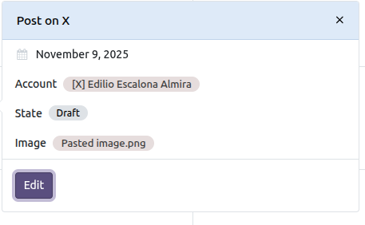
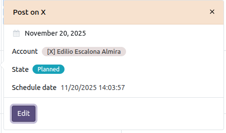
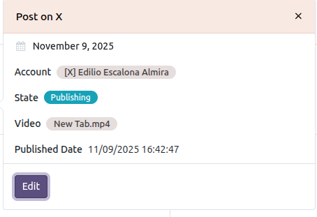
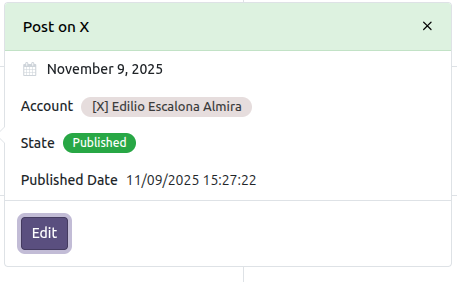
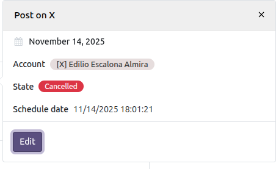
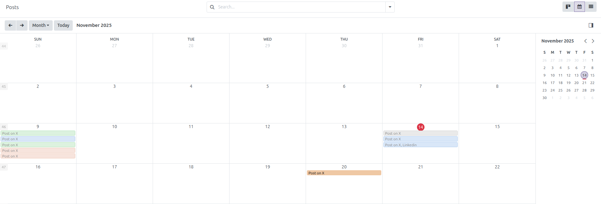

Calendar view
-------------------

1. Go to Social Media > Posts
2. Click on the Calendar icon to open the calendar view
3. Click on a Post and a popover with its details opens. Its *Edit* button
   opens the post form in a dialog, where it can be modified and saved.

Each post is placed on the date it was published; if it has not been published
yet, on its schedule date; and if it is not scheduled, on its creation date.
That is why a scheduled post moves to another day of the calendar once it is
really published.

Posts cannot be rescheduled by dragging them across the calendar: the date
shown is computed from the dates of the post. To change it, open the post and
modify its schedule date.

Deletion is the only action disabled in this view: posts are deleted from the
list or the form.

Colors by publication status
---------------------------

The calendar view will show the posts in different colors depending on their publication status:

- Draft

  
- Planned

  
- Publishing

  
- Partially Published, the post that reached some of its accounts and failed
  on the others
- Published

  
- Cancelled

  

- Calendar view by color

  

Creating a post from the calendar
---------------------------------

Users allowed to create posts can click on an empty day: the post form opens
with *Schedule* selected and 07:00 of that day, in the time zone of the user,
proposed as the schedule date. The accounts and the message are still
required, so the form is the full one, not a quick creation. Once saved, the
post is planned and the scheduler publishes it on that date.

Whenever that proposal is already behind the clock, a date one hour from now
is proposed instead: this happens on a day already past, and also on the
current day once 07:00 has gone by. A schedule date behind the clock cannot be
saved at all: *Social Media Base* refuses it with a validation error.

Uninstalling the module
-----------------------

The calendar view is attached to the posts action of *Social Media Base*
through records that belong to *Social Media Calendar*, so Odoo removes them
on uninstall on its own and the Posts menu keeps working with its kanban,
list and form views. The module stays uninstalled afterwards; only installing
*Social Media Base* again brings it back, because it is auto-installed.
