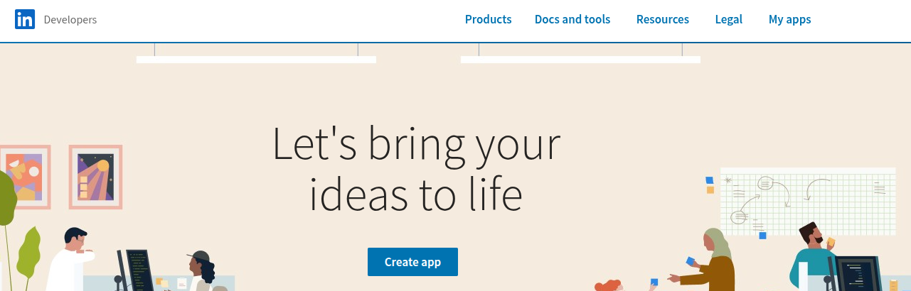

To configure this module, you need to:
---------------

Please note that you must have a developer account.
The steps required for using it are defined below:

Before creating this developer account, you must have a partner company
on your LinkedIn account and be an administrator.

Only **company pages (organizations)** can be linked, never personal
profiles: a post is always published on behalf of the organization. Odoo
only reads the organizations where the member who authorizes is an
`ADMINISTRATOR` whose invitation has already been accepted (`APPROVED`
state). If your role is still pending, LinkedIn does not return the
organization and the wizard ends without creating any account.

The connector needs no additional Python library: it uses `requests`, which
is already shipped with Odoo, so there is nothing to install on the server
besides the module itself.

- Go to https://developer.linkedin.com/
- Create a new Developer App with the *Create app* button.

  

- Fill in the requested fields. In the *Privacy Policy URL* field, copy your company's URL.

  

- Once the app is created, go to the *My Apps* menu and you will see the newly created app; select it.
- Within the app, in the *Settings* tab, verify your company. You will see a button that says Verify. Click it, and in the window that appears in the lower left corner, click the *Generate URL* button. Copy the generated URL into your browser and accept.
- Then go to the *Products* tab and request access to the products granting
  the scopes the installed modules ask for:
  * Community Management API, which grants the three scopes this connector
    needs: `rw_organization_admin`, `w_organization_social` and
    `r_organization_social`. It is not self-serve: LinkedIn reviews the
    request, and until it is approved **no account can be associated at
    all** — the consent screen is all or nothing, so a scope the App was not
    granted fails the whole authorization, not only the calls that need it.
  * Advertising API, only if *Social Media Advertising LinkedIn* is
    installed, for `r_ads`, `rw_ads` and `r_ads_reporting`. It is not
    self-serve either.

  

  Note that some products require you to fill out a form; you must do so, otherwise,
  the necessary scopes for basic use of your account will not be enabled.
  The products, the scopes they grant and the versions of the API are described in the
  [LinkedIn Marketing API documentation](https://learn.microsoft.com/en-us/linkedin/marketing/getting-started)
  and in its [versioning guide](https://learn.microsoft.com/en-us/linkedin/marketing/versioning).

- After requesting the aforementioned Products, go to the Auth tab and you will see all the enabled scopes at the bottom.

  Each module asks for the permissions its own calls consume, so what is
  requested depends on what is installed:

  | Module | Scopes | What needs them |
  | --- | --- | --- |
  | *Social Media LinkedIn* | `rw_organization_admin` | Listing the organizations the member administers, and the figures of the page |
  | | `w_organization_social` | Publishing and deleting a post, and uploading its images and videos |
  | | `r_organization_social` | Reading a publication back, which is what tells one deleted on LinkedIn from one still online |
  | *Social Media LinkedIn Sync* | `r_organization_social` | Reading the feed of the page, the comments and the reactions |
  | *Social Media Advertising LinkedIn* | `r_ads`, `rw_ads`, `r_ads_reporting` | The advertising accounts, their campaigns and their figures |

  All of them have to appear enabled in the *Auth* tab of your App; if one is
  missing, LinkedIn refuses the whole authorization and the Product that
  grants it has to be requested. LinkedIn does not let the member pick part
  of them either: the consent screen is all or nothing, which is why nothing
  is requested "just in case".

  What LinkedIn granted is stored on the account, in the *Granted Scopes*
  field of its *Configuration* tab, so a permission error can be read there
  instead of in the logs. That same field is what the **next** authorization
  requests, and it can be edited:

  * Enable the new Product on your LinkedIn App and wait for it to be
    approved.
  * Add the scopes it grants to the *Granted Scopes* field of the account.
  * Open *Update account*, tick **Update keys** and authorize again on
    LinkedIn.

  Editing the field on its own changes nothing, and ticking only *Update
  token* is not enough either: refreshing a token keeps the scopes it was
  granted, only a new authorization can ask for more. Go straight to *Update
  account* after editing the field, because *Validate token* and any token
  refresh rewrite it with the scopes LinkedIn reports, and the additions typed
  by hand are lost. Beware that a scope
  the Products of your App do not grant makes LinkedIn refuse the whole
  authorization, and the account cannot be authorized again until it is
  removed from the field.

  Every call to the versioned REST API carries the `LinkedIn-Version: 202607`
  and `X-Restli-Protocol-Version: 2.0.0` headers. The OAuth calls of the
  association — the code-for-token exchange and the token introspection —
  and the download of the organization logo do not. LinkedIn retires each
  version of
  the API about a year after publishing it, so the module has to be updated
  periodically: once the version is no longer supported, LinkedIn answers
  every request with a version error.

- At the top of the aforementioned tab, you will see the Client ID and Primary Client Secret information.

- Configure the access points for which you want to use the account. Follow these steps:
  * Go to *Settings* > *Technical* > *Parameters* > *System Parameters*.
  * Search for web.base.url
  * Copy the base URL and concatenate it with the endpoint. Then, in your LinkedIn Developer Account, on the Authentication tab, in the Authorized Redirect URLs for Your App section, add a new item. * Example:
  web.base.url: http://192.168.1.7:8017
  endpoint: /linkedin/callback
  linkedin_url: http://192.168.1.7:8017/linkedin/callback

  

Registering the Client ID and Client Secret. Integration of a user account.
---------------

- Go to *Social Media* > Configuration > Social Media
- Click on  the *Associate Account* button for the desired social media.

  

- A wizard will open for you to add the Client ID and Client Secret obtained
  from your developer account.

  

- By clicking the *Associate* button here, you'll be taken to a LinkedIn authentication page.
  Once you validate your information, LinkedIn brings you back to Odoo: if the association
  succeeded you land directly on the *Social Media* Dashboard with a success notification,
  and if it failed you come back to the start screen with the notification of the error.

  

- Once you have completed these steps and everything is working correctly,
  you can see your account in *Social Media* > Configuration > Accounts
- After the account is associated, the daily figures of the page are read and
  the card of the dashboard is filled. Importing what the page already
  published needs *Social Media LinkedIn Sync*.
- Note that the account credentials (Client ID, Client Secret and tokens)
  are masked and only visible to administrator users.
- The authorization flow is bound to the session that started it: the state
  token sent to LinkedIn only works for the user who opened the wizard, and
  it is discarded once the flow ends, so the same authorization cannot be
  replayed. If the state does not match, the association is refused with
  *Invalid OAuth state token. Please restart the account association
  process.* The flow itself is the one described in the
  [authorization code flow](https://learn.microsoft.com/en-us/linkedin/shared/authentication/authorization-code-flow)
  of LinkedIn.
- If the LinkedIn organization is already linked to an account of another
  Odoo user, the association is refused and nothing is overwritten: only the
  responsible user of the account and the *Social Media / Administrator*
  group can relink it.
- Every account has to use its own credentials: if the Client ID and the
  Client Secret are already registered on another account, the association is
  refused with *An account with this information already exists; please also
  check archived accounts.* The check includes the archived accounts, which
  keep their credentials, so check the *Archived* filter as well before trying
  again. To reauthorize an existing account, use its *Update account* button
  instead of the wizard.

System parameters
---------------

Nothing here has to be set for the connector to work: each key defaults to the
value the code carries, and it only exists once it is written by hand in
*Settings* > *Technical* > *Parameters* > *System Parameters*. They are bounded when they are
read, so a value outside its range is brought back into it instead of being
obeyed.

| Parameter | Default | Unit | Bounds |
| --- | --- | --- | --- |
| `social_media_linkedin.video_poll_attempts` | 30 | polls | at least 1, and at most what the 600 second ceiling allows |
| `social_media_linkedin.video_poll_delay` | 2 | seconds between polls | at least 1 |

The two are the wait LinkedIn needs to finish processing an uploaded video
before the post can be published, and what matters is their product: it is
time the publication spends inside its own transaction. Past the
`limit_time_real` of the deployment — 120 seconds by default, and the
scheduled actions inherit it — the worker is killed with the video already
uploaded on LinkedIn and nothing published in Odoo. That is why the number of
polls is cut down to what 600 seconds allow at the delay in force, and why
raising the wait for a long video means raising `limit_time_real` as well. A
delay longer than the ceiling itself is not cut: it becomes one single wait,
and setting one is asking for the worker to be killed.

Below their bounds the numbers stop making sense rather than merely being
small: zero polls publishes nothing without ever asking LinkedIn, and a delay
under a second turns the wait into a burst against an API whose rate limit the
module does not manage.
