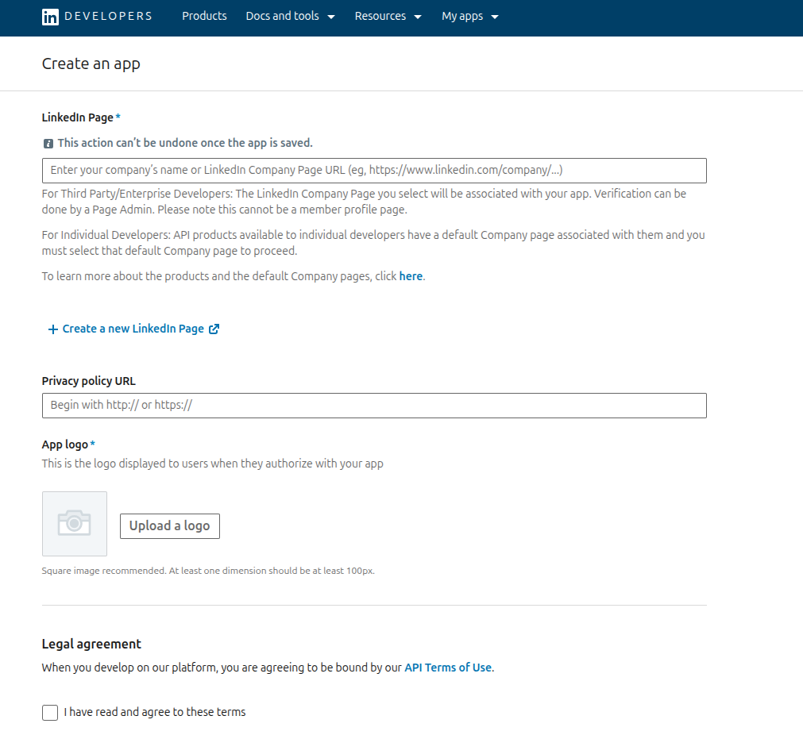
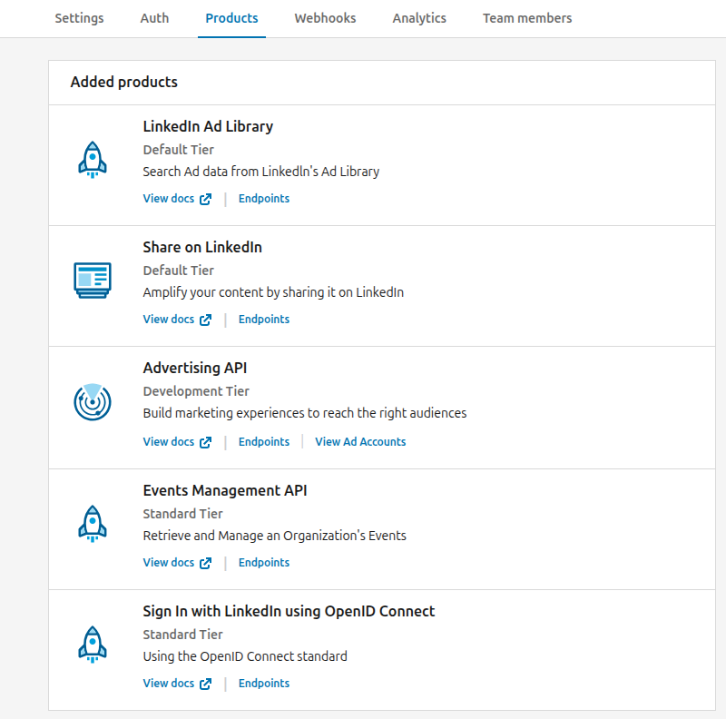
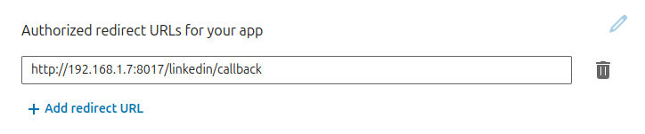
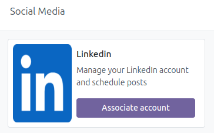
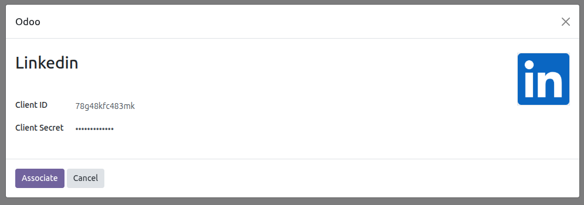
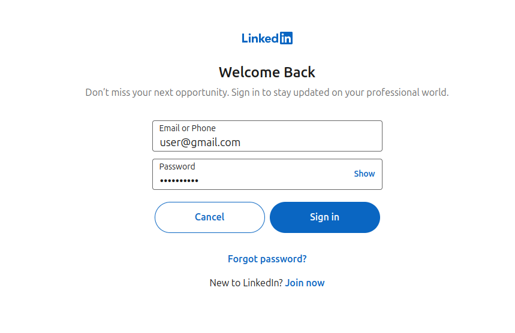

To configure this module, you need to:
---------------

Please note that you must have a developer account.
The steps required for using it are defined below:

Before creating this developer account, you must have a partner company
on your LinkedIn account and be an administrator.

- Go to https://developer.linkedin.com/
- Create a new Developer App.
- Fill in the requested fields. In the *Privacy Policy URL* field, copy your company's URL.

  

- Once the app is created, go to the *My Apps* menu and you will see the newly created app; select it.
- Within the app, in the *Settings* tab, verify your company. You will see a button that says Verify. Click it, and in the window that appears in the lower left corner, click the *Generate URL* button. Copy the generated URL into your browser and accept.
- Then go to the *Products* tab and request access to the following products (for basic and free use):
  * LinkedIn Ad Library
  * Share on LinkedIn
  * Advertising API
  * Events Management API
  * Sign In with LinkedIn using OpenID Connect

  

  Note that some products require you to fill out a form; you must do so, otherwise,
  the necessary scopes for basic use of your account will not be enabled.

- After requesting the aforementioned Products, go to the Auth tab and you will see all the enabled scopes at the bottom.

- At the top of the aforementioned tab, you will see the Client ID and Primary Client Secret information.

- Configure the access points for which you want to use the account. Follow these steps:
  * Go to *Settings* > *Technical* > System Parameters.
  * Search for web.base.url
  * Copy the base URL and concatenate it with the endpoint. Then, in your LinkedIn Developer Account, on the Authentication tab, in the Authorized Redirect URLs for Your App section, add a new item. * Example:
  web.base.url: http://192.168.1.7:8017
  endpoint: /linkedin/callback
  linkedin_url: http://192.168.1.7:8017/linkedin/callback

  

Registering the Client ID and Client Secret. Integration of a user account.
---------------

- Go to *Social Media* > Settings > Social Media
- Click on  the *Associate Account* button for the desired social network.

  

- A wizard will open for you to add the Client ID and Client Secret obtained
  from your developer account.

  

- By clicking the *Associate* button here, you'll be taken to a LinkedIn authentication page.
  Once you validate your information, you'll be taken to the system and the Dashboard view,
  where you'll see your posts.

  

- Once you have completed these steps and everything is working correctly,
  you can see your account in *Social Media* > Configuration > Accounts
