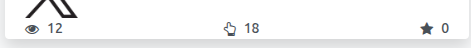

This module provides the necessary functionality for
basic interaction with the LinkedIn social media.

Main features:
- Integration of the LinkedIn company pages (organizations) the user
  administrates; personal profiles are not supported.
- Post creation, with images or a video: LinkedIn publishes either the images
  or the video, never both.
- Comments of a publication, read from the dashboard: LinkedIn serves the
  replies of a comment apart, so they are asked for when the thread is
  opened. A comment and a reply are written under the organization, and the
  thread offers to delete a comment: LinkedIn is the one deciding whether the
  organization may, and its refusal is reported instead of removing it here.
- *Recommend* on a publication and on any of its comments, sent under the
  organization. LinkedIn accepts one reaction per account and only `LIKE` is
  sent, so recommending twice answers that the account already reacted.
- Full resync of a page, which reads the whole feed and reports the
  publications deleted on LinkedIn.
- Reports and native graph and pivot views over the daily statistics of the
  account, with agnostic metrics.
- What LinkedIn will not publish, shown on the post while it is written. The
  message is checked against **3000 characters**, and the medias against **20
  images** of at most **10 MB** each in JPG, PNG or GIF, and **one video** of
  at most **500 MB** in MP4. A post carrying a video is published without its
  images, so with a video none of the image rules apply and the post is warned
  that only the video goes out. The same checks refuse the publication if the
  post reaches it anyway, through an import or an RPC call.

Statistics account
-------------------
1. The eye icon: Total number of views, which may include multiple views by the same user.
2. The hand icon: means the interactions (clicks, likes, comments and shares)
   accumulated by the posts created historically on the account.
3. The star icon: the engagement of the publications. LinkedIn reports an
   engagement rate for each publication, and the account adds them up, so the
   figure is a sum of rates and not a percentage of the account.

   
