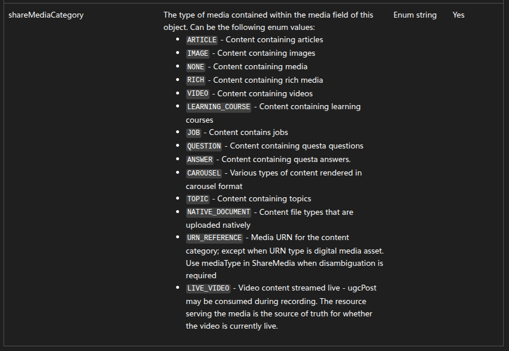

Like the comments
-----------------

- To like a comment you need the scopes:

  * w_member_social_feed,
  * r_organization_social_feed
    Which are special permissions granted by LinkedIn

Comments on publications
------------------------

- Images, videos, documents, or any type of media are not allowed
  in post comments via the API, due to LinkedIn's own limitations.
  Although there is an example of how to do it in the documentation,
  in practice it doesn't work, even in paid versions.

Post with video or image
------------------------

- The API currently only supports creating a post with either an image or a video,
  not both at the same time.
- Only one shareMediaCategory can be sent per post.

  https://learn.microsoft.com/en-us/linkedin/marketing/community-management/shares/ugc-post-api?view=li-lms-2025-11&tabs=http#mediarichcontent

  