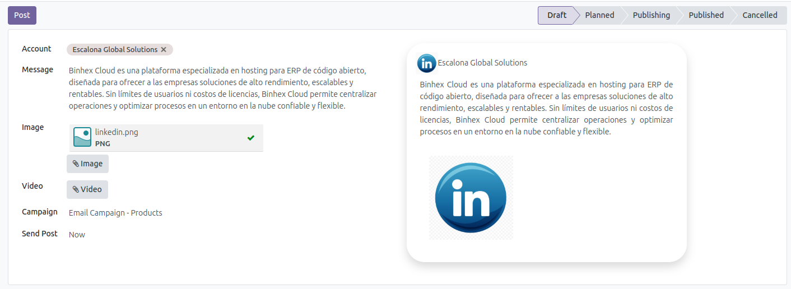
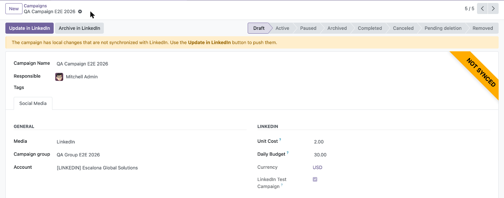
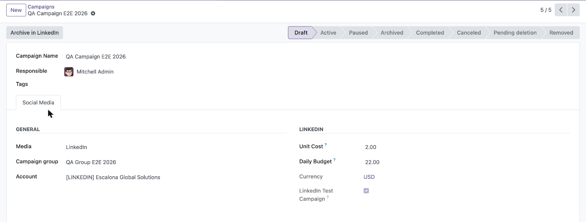
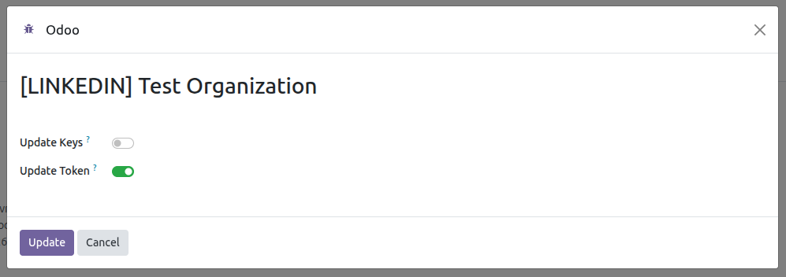

List of posts generated from Odoo.
---------------

Only posts generated using Odoo are displayed.

- Go to *Social Media* > Post

Generate a post.
---------------

This feature acts as a template for generating multiple posts
from a single view, depending on the selected accounts.

- Go to *Social Media* > Post > New or Go to *Social Media* > Dashboard > Add Post
- Fill in the required fields
  
- Save
- Click on the *Post* button
- Posts deleted directly on LinkedIn are marked as *Deleted* in Odoo during
  the statistics synchronization, so the dashboard keeps their history.

Create a campaign in LinkedIn.
---------------

To link a post to a campaign, the campaign must already exist in LinkedIn
(only campaigns already synchronized with LinkedIn can be selected on the
post). Publishing a post does not create the campaign anymore.

- Go to *Social Media* > Campaigns > Campaigns and open the campaign
- Fill in the campaign group, account, budget and currency fields
- Choose the *LinkedIn Ad Format*: *Standard update* for posts with text or
  images, *Single video* for posts with a video. LinkedIn fixes the format
  when the campaign is created and only accepts posts of that format
  afterwards, so a post with a video needs its own video campaign.
- The *LinkedIn Objective* is required by LinkedIn for the video format.
  See the ROADMAP section about the objectives that are not offered here.
- Click on the *Create in LinkedIn* button
- The campaign group and the campaign are created in LinkedIn in **DRAFT**
  status, so no budget is spent until you activate them from the LinkedIn
  Campaign Manager.
- A campaign group can also be created on LinkedIn on its own: open the
  group and click its *Create in LinkedIn* button (it requires a positive
  total budget and a currency). If you forget to do it, the group is
  created automatically when the first campaign of the group is published.
- When a post linked to a campaign is published, it is attached to the
  campaign as a sponsored creative. If the post is published but the creative
  cannot be linked, the post is kept and the error is logged in the chatter.
- A post with more than one image cannot be sponsored: LinkedIn publishes it
  as a multi-image post and does not accept that format as an ad, so linking
  it to a campaign is refused before publishing.

Import campaigns from LinkedIn.
---------------

- Go to *Social Media* > Configuration > Accounts
- Select the account
- Click on the *Import campaigns* button
- The campaign groups, campaigns and their sponsored creatives are imported
  from LinkedIn Ads and linked to the matching posts.
- The real LinkedIn status of each campaign and campaign group (Draft,
  Active, Paused, Archived...) is stored in a read-only *LinkedIn Status*
  field, shown as a status bar on the form and refreshed on every import.
  Campaigns flagged as test campaigns on LinkedIn are marked as well.
- Campaigns and campaign groups deleted on LinkedIn (*Pending deletion*,
  *Removed*) are hidden in the LinkedIn Campaign Manager, but the API
  keeps returning them because of their performance data. They are
  therefore kept in Odoo as history, and a note is logged in their chatter
  when the deletion is detected. Keep in mind that deleting a campaign
  group on LinkedIn also deletes all its campaigns and ads.

Update a campaign in LinkedIn.
---------------

- When you modify in Odoo the editable fields of a campaign (name, unit
  cost, daily budget, campaign group) or of a campaign group (name, total
  budget) that already exists on LinkedIn, the record shows a *Not synced*
  ribbon, a warning banner explaining that the local changes have not been
  pushed yet, and an *Update in LinkedIn* button. The tracked fields also
  log their changes in the chatter.

  

- Click *Update in LinkedIn* to push the local values to LinkedIn. To move
  the campaign to another campaign group, the target group must already
  exist on LinkedIn.
- Synchronization priority is hybrid: the LinkedIn-only fields (status,
  test flag) are always refreshed by *Import campaigns*; for the editable
  fields, your local pending changes are preserved by the import — the
  LinkedIn values are logged in the chatter so you can decide whether to
  keep your changes (push them with *Update in LinkedIn*) or re-type the
  LinkedIn ones.
- When the LinkedIn status is *Archived*, *Canceled*, *Pending deletion*
  or *Removed*, the campaign or campaign group cannot be modified in Odoo
  (LinkedIn does not allow editing them either): the editable fields
  become read-only, the *Update in LinkedIn* button is hidden and a red
  banner explains the situation. The import keeps refreshing their status,
  so an archived record becomes editable again once it is unarchived on
  LinkedIn.

Archive a campaign or a campaign group in LinkedIn.
---------------

- LinkedIn does **not** allow deleting a campaign or a campaign group
  through its API. Archiving is the only way to end them, and it is what the
  *Archive in LinkedIn* button does.
- Go to *Social Media* > Campaigns, open the campaign or the campaign group
  and click *Archive in LinkedIn*. The button is only shown when the record
  already exists on LinkedIn and is not already archived, canceled or
  deleted.

  

- The campaign stops running on LinkedIn and disappears from the Campaign
  Manager active lists, but it is kept in Odoo with its performance data.
  Its *LinkedIn Status* becomes *Archived*, which makes the record read-only
  in Odoo, because LinkedIn no longer accepts changes on it.
- **It cannot be reactivated from Odoo.** To unarchive it, use the LinkedIn
  Campaign Manager and then run *Import campaigns* to refresh the status.
- Archiving a campaign group archives all its campaigns on LinkedIn as well.
  Odoo does not know about that until you run *Import campaigns*, so run it
  afterwards to refresh them.
- Deleting the campaign in Odoo does not do anything on LinkedIn: the
  campaign keeps running there and the next *Import campaigns* brings it
  back. Use *Archive in LinkedIn* to actually end it.

Update token, client ID, client Secret and organization data
---------------

- Go to *Social Media* > Configuration > Accounts
- Select the account
- Click on the *Update account* button

  

- In the wizard that appears, if none of the checkboxes are selected and the
  *Update* button is pressed, the system will update only the organization's data.
- If the *Update keys* checkbox is selected, the current Client ID and Client Secret
  values will be displayed by default. Modify any of these values and authentication
  will be performed again through LinkedIn to update these values and the token.

  

- Selecting the *Update token* checkbox will update the current token.

  

Validate the token
---------------

- Go to *Social Media* > Configuration > Accounts
- Select the account and open the *Configuration* tab
- Click on the *Validate token* button. When the access token or the refresh
  token has expired, LinkedIn is asked whether the token is still valid; if
  it is not, the account association is started again to renew it. Otherwise
  a notification confirms that the token is valid.

  

Archive Account Linkedin
----------------------------

- Go to *Social Media* > Configuration > Accounts
- Select the account
- Click on the *Archive account* button

  

- Please note that all data associated with this account will be archived.
- If you associate the same LinkedIn account again later, the archived
  account and its related data will be reactivated instead of creating a
  duplicate.
- An archived account can be deleted permanently with the *Delete
  permanently* button, only available to a social media administrator. The
  LinkedIn publications stay online, only the Odoo history is removed.

Uninstalling the module
----------------------------

Uninstalling *Social Media Linkedin* does not delete the accounts nor their
publication history:

- The access token and the refresh token are cleared, so no credential
  outlives the module.
- The LinkedIn accounts are archived, together with their posts, campaigns
  and campaign groups.
- The LinkedIn specific data is lost, because Odoo drops the columns of an
  uninstalled module: the application Client ID and Client Secret, and the
  identifier of the sponsored creative of every published post.
- The identifier of each account, publication and campaign on LinkedIn is
  kept, so installing the module back and associating the account again
  reactivates the archived history and updates it, instead of importing
  everything as duplicated records.
