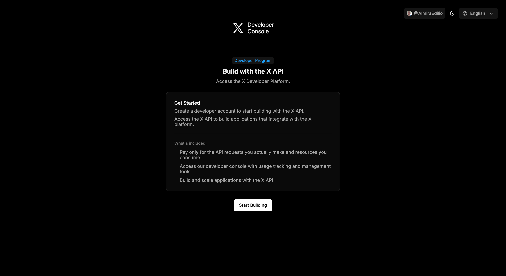
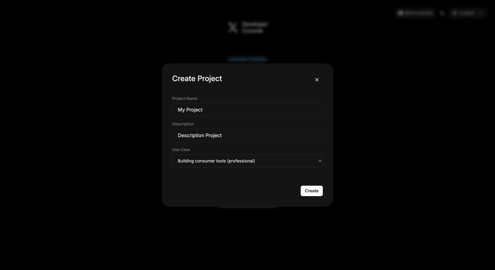
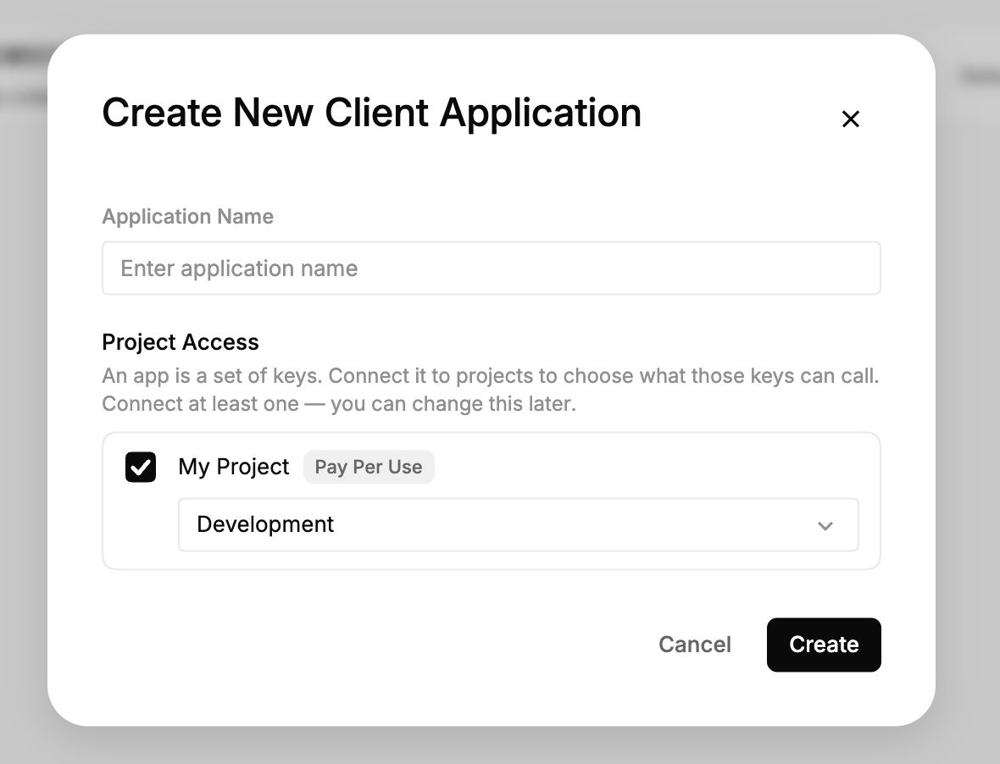
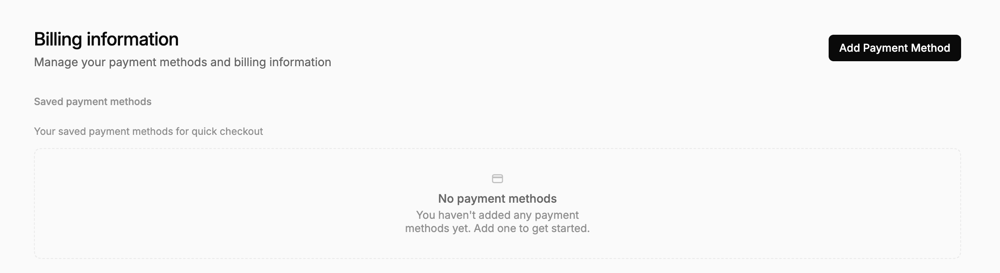
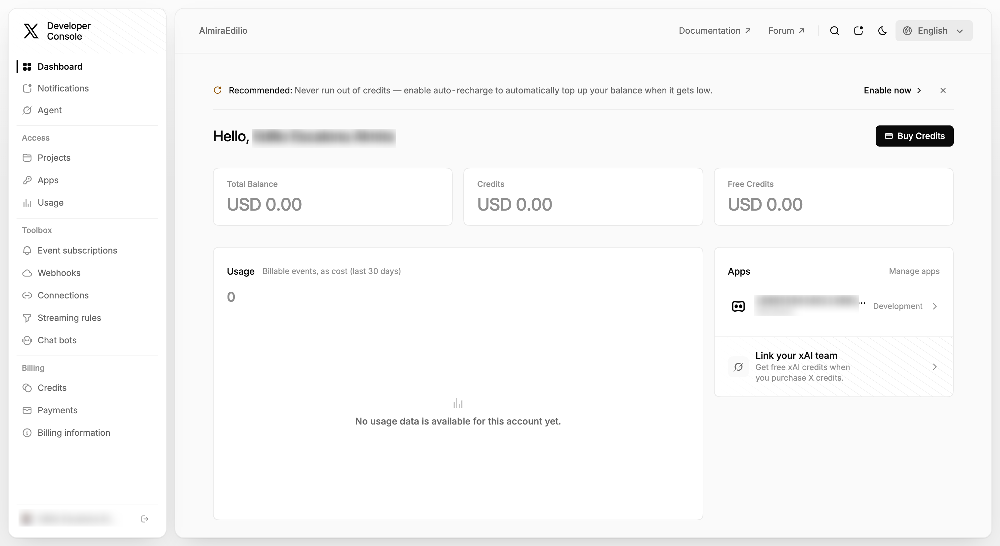
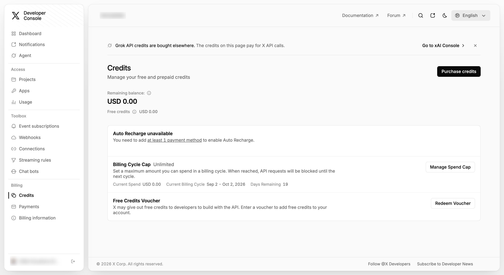
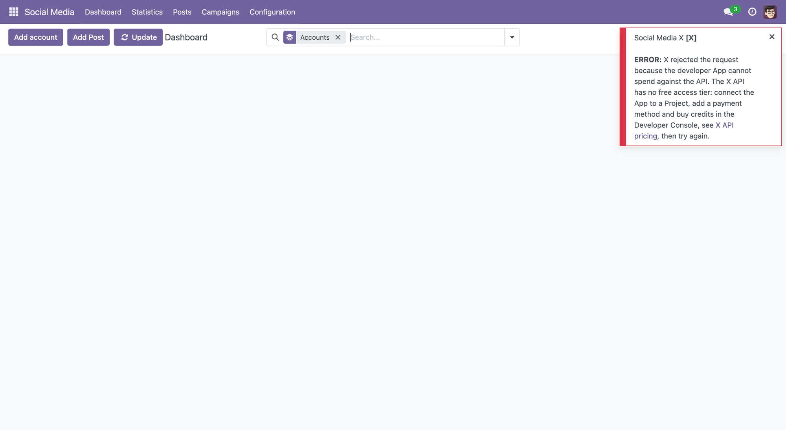

To configure this module, you need to:
---------------
Please note that you must have a developer account.

**Important:** the X API v2 endpoints used by this module require a developer
App **attached to a Project** and an account on the **pay-per-use** pricing of
X, see [about the X API](https://docs.x.com/x-api/getting-started/about-x-api).
There is no Free access tier: an App that cannot spend against the API is
refused, so the account cannot be associated with one. Pay per use is not a
subscription — there is no monthly fee and no minimum purchase, the App only
needs a positive credit balance — but the balance has to be there before the
first call. The association wizard shows this warning, and when X rejects the
request for this reason the module replaces the raw error with a message
pointing to the pricing page. Note that such an App can be refused at two
different moments: when the request token is asked, before any authorization
screen is shown, and the wizard answers with the pricing notice; or later,
when the module reads the authorized user, and the message is then delivered
on the Dashboard.

A call made with an App that cannot spend answers ``403 Forbidden``, either
with ``"reason": "client-not-enrolled"`` or asking for an App attached to a
Project, since only an enrolled App can belong to one. Every endpoint this
module uses is affected: linking the account, refreshing the data of the
account, publishing (message and media upload), deleting, checking whether a
publication is still online and reading the figures of the recent ones.

What each call of the module costs, according to the
[pricing of X](https://docs.x.com/x-api/getting-started/pricing):

| What the module does | Endpoint | Price |
| --- | --- | --- |
| Publish a post | Post creation | $0.015 |
| Publish a post carrying a link | Post creation with URL | $0.200 |
| Read the figures of its own publications | Owned read | $0.001 per post |
| Read the authorized user | Users | $0.010 |

**A post that carries a link costs more than ten times a post that does
not.** `social_media_base` rewrites the links of a post through
`link_tracker`, so a post with a tracked link is billed at the higher price.
It is the single decision that moves the bill of a database that only
publishes.

The same resource asked for twice within 24 hours is charged once, which is
what keeps the scheduled actions of the module cheap: the check of network
updates every two hours and the daily refresh of the figures read the same
publications over and over.

So a database that only publishes spends cents a month: this module reads
nothing but its own publications, and it reads them at the price of an owned
read. What grows with the account is the history, and the history is read by
*Social Media X Sync*, which is a separate module nobody has to install. A
deployment that publishes and watches its own figures does not need it.

There is no way around the API for what this module does. Publishing on X
through anything else means either a reseller that pays the same API and
charges for it on top, or driving the web with the session of the user, which
its terms of service forbid and this module does not implement.

* X API pricing and plans: https://docs.x.com/x-api/getting-started/pricing
* Rate limits according to plan: https://docs.x.com/x-api/fundamentals/rate-limits
* How to get access to the API: https://docs.x.com/x-api/getting-started/getting-access

Creating the developer account
---------------
The developer account is not the X account: it is the enrolment of that X
account in the API, and it is asked for once per organization, not per social
account published from Odoo.

- Sign in at the [Developer Console](https://console.x.com) with the X account
  that owns the App and press *Start Building*. It does not have to be the
  account whose posts Odoo publishes — the App belongs to whoever administers
  it, and each account authorizes it afterwards from the wizard of *Social
  Media X*. Accept the Developer Agreement and Policy if X asks for it.

  

- Create a project. The use case declared here is what X reads if it ever
  reviews the App.

  

- Create the App inside that project. The App is the set of keys, and the
  project is what those keys are allowed to call, so an App connected to no
  project answers ``403`` to everything.

  

- Add a payment method in *Billing* > *Billing information* with **Add Payment
  Method**, following the steps X asks for.

  

- Buy credits from the Dashboard or from *Billing* > *Credits*, before
  associating any account in Odoo: reading the authorized user is already a
  billed call, so an App with no balance fails at the association itself and
  never reaches the Dashboard of Odoo. A spend cap per billing cycle is set
  on that same screen, and it is what keeps a mistake from spending more than
  intended — when the cap is reached X blocks the requests until the next
  cycle.

  

  

The screens below are the ones of the developer portal. X moves them from
time to time; the names of the settings are what matters, not where the
picture puts them.

The steps required for using it are defined below:

- Go to the [Developer Console](https://console.x.com)
- Create a developer account as described above.
- Once the account is created, go to *Access* > *Apps* and select the App.
  What it shows as *Project Access* is the project its keys call through.

  

- Open *Settings* to reach the authentication settings of the App.

  

- Once on the page, in the App Permissions section, select *Read and write*,
  which is what the endpoints this module calls need.

  

- Go to the App Type section and select Web App, Automated App or Bot.

  

- Then, in the Callback URI / Redirect URL section, add a new address. Here are the steps to get that URL in Odoo:
   * Go to *Settings* > *Technical* > *Parameters* > *System Parameters*.
   * Search for web.base.url
   * Copy the base URL and concatenate it with the endpoint.
     Example:
      web.base.url: http://192.168.1.7:8017
      endpoint: /social_x/callback (this value is fixed)
      callback_url: http://192.168.1.7:8017/social_x/callback

- Then go to the Website URL section and add your X profile address.

   Example: https://x.com/AccountTest

  

- Finally, go to the *Keys & Tokens* tab of the App, press the *Regenerate*
   button of the *Consumer Key*, and then in the window that appears, confirm
   the generation of the API Key and API Key Secret values. The Console lists
   that pair under *OAuth 1.0 Keys* as the **Consumer Key**, which is the same
   thing this module and X itself call API Key and API Key Secret. X shows the
   pair once, and regenerating it again invalidates the one already stored in
   Odoo: an App whose keys were regenerated after being registered in Odoo
   answers ``{"code": 32, "message": "Could not authenticate you."}`` to the
   association.

  

  

Learn more at the [X Developer Console](https://console.x.com)

Registering the API Key and API Key Secret. Integration of a user account.
---------------

- Go to *Social Media* > *Configuration* > *Social Media*
- Click on  the *Associate Account* button for the desired social media.

  

- A wizard will open for you to add the API Key and API Key Secret obtained
  from your developer account.

  

- By clicking the *Associate* button here, you'll be taken to a X
  authentication page, which lists what the App is allowed to do with the
  account. Once you authorize it, you'll be taken back to the system and the
  Dashboard view, where you'll see your posts.

  

- An App that cannot spend against the API is refused here, after the
  authorization: X answers the reading of the authorized user with ``403``,
  the account is not created and the Dashboard explains it. The authorization
  itself is granted, so nothing has to be undone on the X side — add credits
  and associate again.

  

- Once you have completed these steps and everything is working correctly,
  you can see your account in *Social Media* > Configuration > Accounts
- Note that the account credentials (API Key, API Secret and tokens) are only
  visible to users with administration rights (*Settings*). The account form
  shows the API Key in read-only mode and the API Secret masked; the tokens
  are never displayed.
- The authorization flow is bound to the session that started it: the request
  token returned by X only works for the user who opened the wizard. A
  callback without a request token, or with the request token of another
  user, is refused without creating or modifying anything; the user gets the
  generic notice *The account could not be associated. Check the server log
  for details.* and the exact reason is kept in the server log, so the raw
  answer of the provider is never exposed.
- Each X account has to be associated with its own pair of credentials: if an
  account already exists (even archived) with the same *API Key* and *API
  Secret*, the association is refused with *An account with that information
  already exists.* Create a different developer App for that account.
- Besides the OAuth 1.0a authorization of the user, the module obtains an
  application-only *bearer token* (OAuth 2.0 *client credentials*) from the
  same API Key and API Secret; that is the one the reads about the posts
  answer to — the figures of the recent publications, the check that one of
  them is still online and whatever a synchronization module asks for —
  while reading the authorized user, which is what the association and the
  update of the data of the account do, travels with the OAuth 1.0a
  credentials of the user, see
  [about the X API](https://docs.x.com/x-api/getting-started/about-x-api). If X
  does not deliver it, the account is not created and the notice *The account
  was not created: the OAuth2 access token could not be obtained.* is shown.
  In the same way, if X does not answer the access token correctly when
  closing the authorization, the account is not created and the user gets the
  same generic notice, the reason returned by X being kept in the server log.
- Publishing with images or video uses the
  [media upload](https://docs.x.com/x-api/media/upload-media) endpoint of the
  X API v1.1 besides the v2 endpoints. The App has to have access to both: on
  a plan without that access, the publications with attachments fail even
  though the text-only ones work.
- The X account being authorized has to be active and not protected, and the
  App needs read and write permission. Odoo does not check it beforehand: if X
  refuses, the error returned by X is displayed on the Dashboard and the
  account is not associated.
- If the X account is already linked to an account of another Odoo user, the
  association is refused and nothing is overwritten: only the responsible
  user of the account and the *Social Media / Administrator* group can
  relink it.
