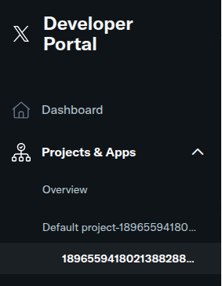
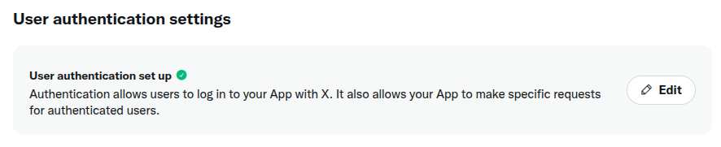
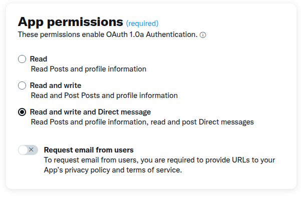
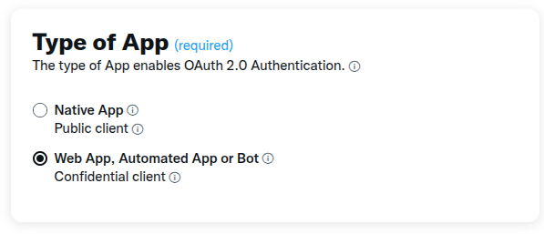
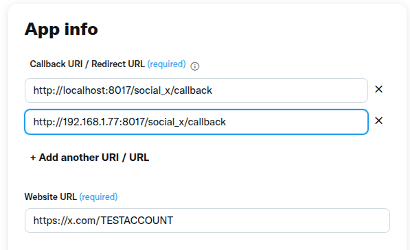
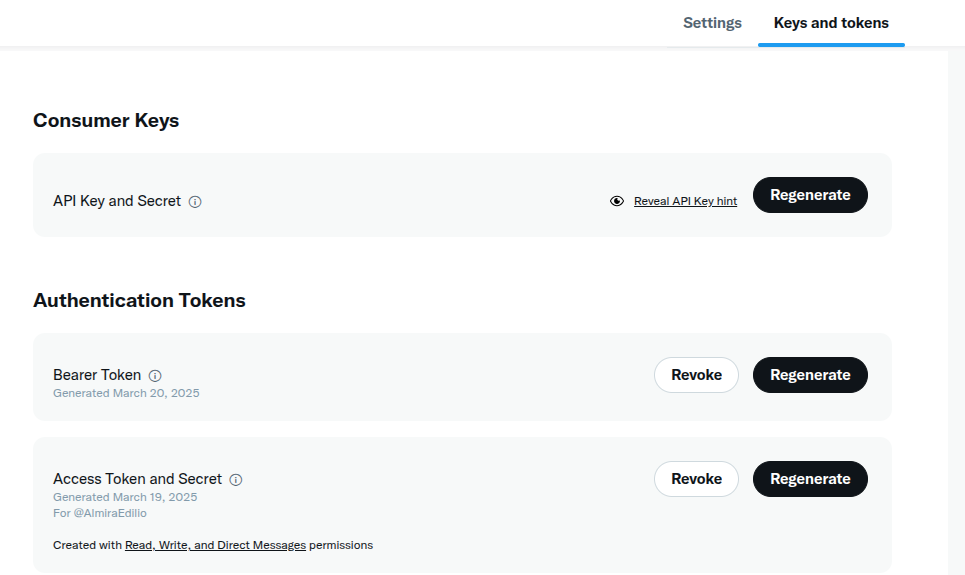
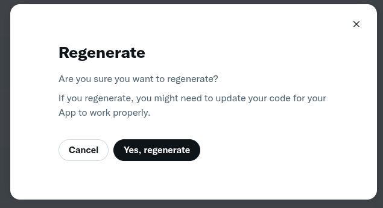

To configure this module, you need to:
---------------
Please note that you must have a developer account.

**Important:** the X API v2 endpoints used by this module require a developer
App **attached to a Project** and a **paid plan** (Pay Per Use, or a legacy
Basic/Pro subscription), see
[about the X API](https://docs.x.com/x-api/getting-started/about-x-api). Since February 2026 the Free access tier no longer
grants general access to the API, so the account cannot be associated with a
Free-tier App. The association wizard shows this warning, and when X rejects
the request for this reason the module replaces the raw error with a message
pointing to the pricing page. Note that the authorization screen of X is still
shown with a Free-tier App: the rejection only happens afterwards, when the
module reads the authorized user, and the message is then displayed on the
Dashboard.

A call made with a Free-tier account answers ``403 Forbidden``, either with
``"reason": "client-not-enrolled"`` or asking for an App attached to a
Project, since only a paid App can belong to one. Every endpoint this module
uses is affected: reading posts, publishing, comments and statistics.

* X API pricing and plans: https://docs.x.com/x-api/getting-started/pricing
* Rate limits according to plan: https://docs.x.com/x-api/fundamentals/rate-limits
* How to get access to the API: https://docs.x.com/x-api/getting-started/getting-access

The steps required for using it are defined below:

- Go to https://developer.twitter.com/en/portal/dashboard
- Create a developer account.
- Once the account is created, go to Projects and APPS -> Default Project and select it.

  

- Then scroll to the bottom of the page and press the Edit button.

  

- Once on the page, in the App Permissions section, select the Read and Write and Direct Messages.

  

- Go to the App Type section and select Web App, Automated App or Bot.

  

- Then, in the Callback URI / Redirect URL section, add a new address. Here are the steps to get that URL in Odoo:
   * Go to *Configuration* > *Technical* > System Parameters.
   * Search for web.base.url
   * Copy the base URL and concatenate it with the endpoint.
     Example:
      web.base.url: http://192.168.1.7:8017
      endpoint: /social_x/callback (this value is fixed)
      callback_url: http://192.168.1.7:8017/social_x/callback

- Then go to the Website URL section and add your X profile address.

   Example: https://x.com/AccountTest

  

- Finally, go to Projects and APPS -> Default Project -> Keys and Tokens,
   press the Regenerate button, and then in the window that appears, confirm
   the generation of the API Key and API Key Secret values.

  

  

Learn more at [X Developer Portal](https://developer.twitter.com)

Registering the API Key and API Key Secret. Integration of a user account.
---------------

- Go to *Social Media* > Configuration > Social medias
- Click on  the *Associate Account* button for the desired social media.

  

- A wizard will open for you to add the API Key and API Key Secret obtained
  from your developer account.

  

- By clicking the *Associate* button here, you'll be taken to a X authentication page.
  Once you validate your information, you'll be taken to the system and the Dashboard view,
  where you'll see your posts.

  

- Once you have completed these steps and everything is working correctly,
  you can see your account in *Social Media* > Configuration > Accounts
- After the account is associated, an initial synchronization of its posts
  and statistics is triggered automatically.
- Note that the account credentials (API Key, API Secret and tokens) are only
  visible to users with administration rights (*Settings*). The account form
  shows the API Key in read-only mode and the API Secret masked; the tokens
  are never displayed.
- The authorization flow is bound to the session that started it: the request
  token returned by X only works for the user who opened the wizard. A
  callback without a request token, or with the request token of another
  user, is refused without creating or modifying anything; the user gets the
  generic notice *The account could not be associated. Check the server log
  for details.* and the exact reason is kept in the server log, so the raw
  answer of the provider is never exposed.
- Each X account has to be associated with its own pair of credentials: if an
  account already exists (even archived) with the same *API Key* and *API
  Secret*, the association is refused with *An account with that information
  already exists.* Create a different developer App for that account.
- Besides the OAuth 1.0a authorization of the user, the module obtains an
  application-only *bearer token* (OAuth 2.0 *client credentials*) from the
  same API Key and API Secret; that is the one used to read publications,
  comments and statistics, see
  [about the X API](https://docs.x.com/x-api/getting-started/about-x-api). If X
  does not deliver it, the account is not created and the notice *The account
  was not created: the OAuth2 access token could not be obtained.* is shown.
  In the same way, if X does not answer the access token correctly when
  closing the authorization, the account is not created and the user gets the
  same generic notice, the reason returned by X being kept in the server log.
- Publishing with images or video uses the
  [media upload](https://docs.x.com/x-api/media/upload-media) endpoint of the
  X API v1.1 besides the v2 endpoints. The App has to have access to both: on
  a plan without that access, the publications with attachments fail even
  though the text-only ones work.
- The X account being authorized has to be active and not protected, and the
  App needs read and write permission. Odoo does not check it beforehand: if X
  refuses, the error returned by X is displayed on the Dashboard and the
  account is not associated.
- If the X account is already linked to an account of another Odoo user, the
  association is refused and nothing is overwritten: only the responsible
  user of the account and the *Social Media / Administrator* group can
  relink it.
