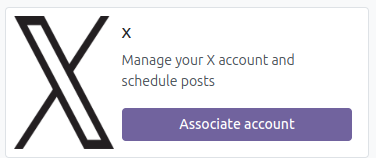
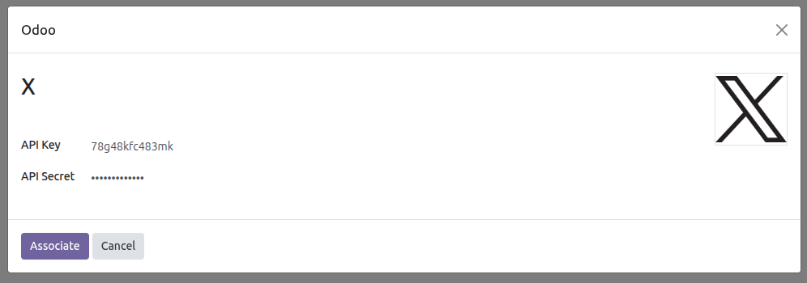
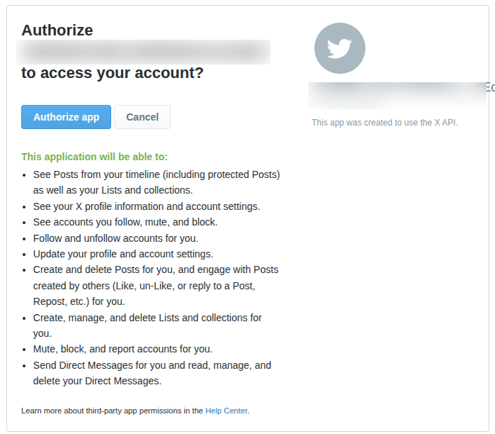

To configure this module, you need to:
---------------
Please note that you must have a developer account.
The steps required for using it are defined below:

- Go to https://developer.twitter.com/en/portal/dashboard
- Create a developer account.
- Once the account is created, go to Projects and APPS -> Default Project and select it.

  

- Then scroll to the bottom of the page and press the Edit button.

  

- Once on the page, in the App Permissions section, select the Read and Write and Direct Messages.

  

- Go to the App Type section and select Web App, Automated App or Bot.

  

- Then, in the Callback URI / Redirect URL section, add a new address. Here are the steps to get that URL in Odoo:
   * Go to *Configuration* > *Technical* > System Parameters.
   * Search for web.base.url
   * Copy the base URL and concatenate it with the endpoint.
     Example:
      web.base.url: http://192.168.1.7:8017
      endpoint: /social_x/callback (this value is fixed)
      linkedin_url: http://192.168.1.7:8017/social_x/callback

  

- Then go to the Website URL section and add your X profile address.

   Example: https://x.com/AccountTest

  

- Finally, go to Projects and APPS -> Default Project -> Keys and Tokens,
   press the Regenerate button, and then in the window that appears, confirm
   the generation of the API Key and API Key Secret values.

  

  

Learn more at [X Developer Portal](https://developer.twitter.com)

Registering the API Key and API Key Secret. Integration of a user account.
---------------

- Go to *Social Media* > Settings > Social Media
- Click on  the *Associate Account* button for the desired social network.

  
-
- A wizard will open for you to add the API Key and API Key Secret obtained
  from your developer account.

  

- By clicking the *Associate* button here, you'll be taken to a X authentication page.
  Once you validate your information, you'll be taken to the system and the Dashboard view,
  where you'll see your posts.

  

- Once you have completed these steps and everything is working correctly,
  you can see your account in *Social Marketing* > Configuration > Accounts
