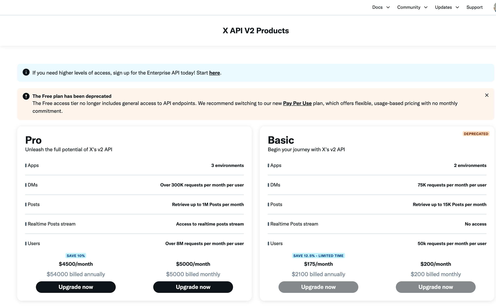

- Since February 2026, X deprecated the Free access tier: it no longer grants
  general access to the X API v2 endpoints used by this module (reading posts,
  publishing, comments, statistics). API calls made with a Free-tier account
  return ``403 Forbidden``, either with ``"reason": "client-not-enrolled"`` or
  asking for an App attached to a Project, since only a paid App can belong to
  one. A paid plan is therefore required to use this module: the default
  **Pay Per Use** plan, or the legacy Basic/Pro plans for existing
  subscribers.

  

  * X API pricing and plans: https://docs.x.com/x-api/getting-started/pricing
  * The action of giving like or followers is not enabled in the free version: https://devcommunity.x.com/t/update-to-x-api-free-tier-removal-of-like-and-follow-endpoints/247646
  * Rate limits according to plan: https://docs.x.com/x-api/fundamentals/rate-limits
  * Frequently asked: https://developer.x.com/en/support/x-api/v2

- Also keep in mind that if you want to post the same content on the same accounts (username X),
  the API will not allow it for spam reasons.
