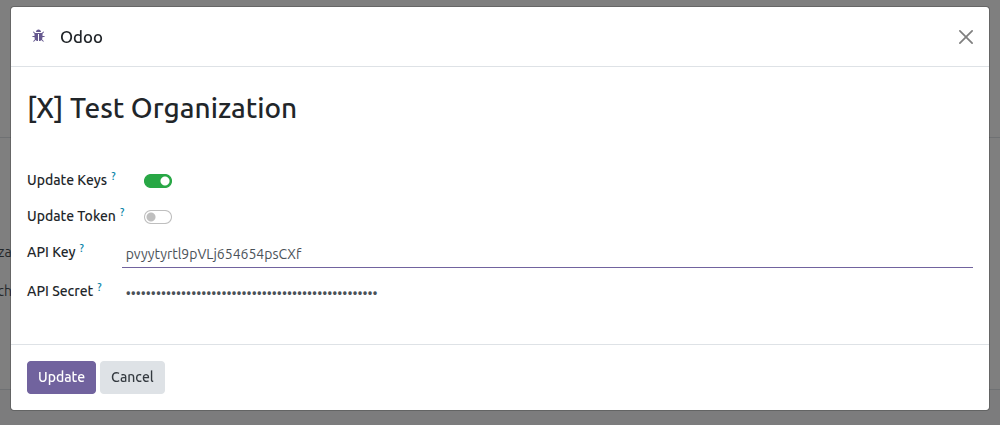
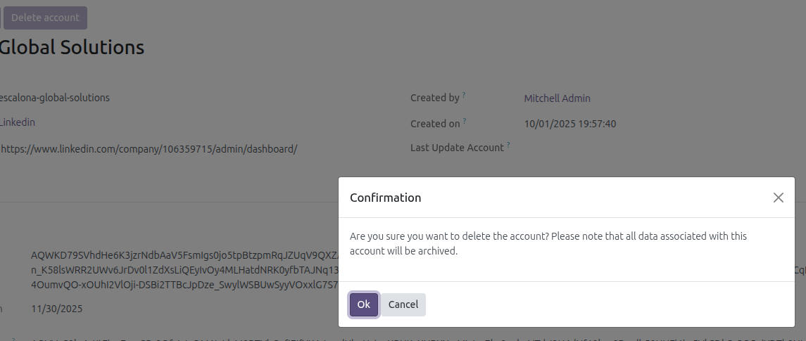

List of posts generated from Odoo.
---------------

Only posts generated using Odoo are displayed.

- Go to *Social Media* > Post

Generate a post.
---------------

This feature acts as a template for generating multiple posts
from a single view, depending on the selected accounts.

- Go to *Social Media* > Post > New or Go to *Social Media* > Dashboard > Add Post
- Fill in the required fields
  
- Save
- Click on the *Post* button

Update token, API Key, API Secret and account data
---------------

- Go to *Social Media* > Configuration > Accounts
- Select the account
- Click on the *Update account* button

  

- In the wizard that appears, if none of the checkboxes are selected and the
  *Update* button is pressed, the system will update only the account's data.
- If the *Update keys* checkbox is selected, the current API Key and API Secret
  values will be displayed by default. Modify any of these values and authentication
  will be performed again through X to update these values and the token.

  

- Selecting the *Update token* checkbox will update the current token.

  

Archive Account X
----------------------------
- Go to *Social Media* > Configuration > Accounts
- Select the account
- Click on the *Archive account* button

  

- Please note that all data associated with this account will be archived.
- If you associate the same X account again later, the archived account and
  its related data will be reactivated instead of creating a duplicate.
- An archived account can be deleted permanently with the *Delete
  permanently* button, only available to a social media administrator. The X
  publications stay online, only the Odoo history is removed.

Enable since
------------------------
- Go to *Social Media* > Configuration > Accounts
- Select the account
- Select *Enable since*
- The *Post since* field is then enabled, allowing you to
  select the post to start the search for in the next post
  retrieval. Note that metrics for older posts will not be updated
  if this option is selected.

  

Uninstalling the module
------------------------

Uninstalling *Social Media X* does not delete the accounts nor their
publication history:

- The access tokens are cleared, so no credential outlives the module.
- The X accounts are archived, together with their posts.
- The X specific data is lost, because Odoo drops the columns of an
  uninstalled module: the API Key, the API Secret and the OAuth 1 tokens.
- The identifier of each account and publication on X is kept, so installing
  the module back and associating the account again reactivates the archived
  history and updates it, instead of importing everything as duplicated
  records.
