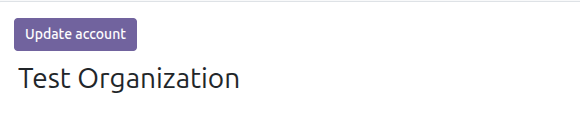
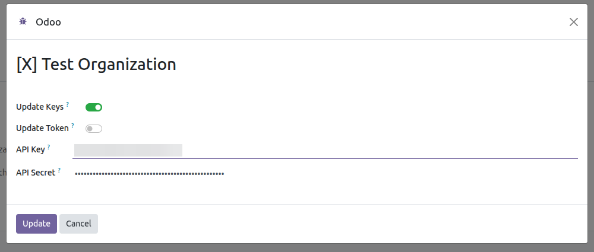
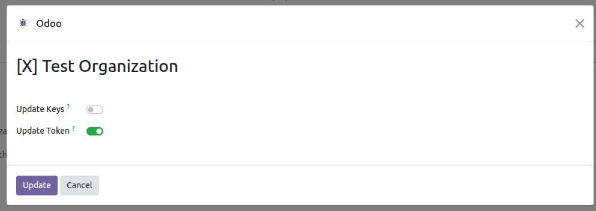
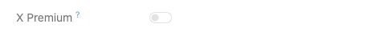
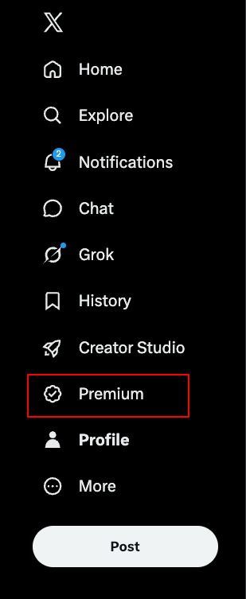
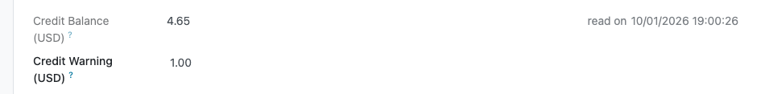

List of posts generated from Odoo.
---------------

Only posts generated using Odoo are displayed.

- Go to *Social Media* > *Posts*

Generate a post.
---------------

This feature acts as a template for generating multiple posts
from a single view, depending on the selected accounts.

- Go to *Social Media* > *Posts* > New or Go to *Social Media* > *Dashboard* > Add Post
- Fill in the required fields
- When the post is created, every X account of the active company is selected
  by default in *Accounts*; review the list and remove the ones you do not want
  to use before saving.
- Save
- Click on the *Post* button
- A publication shares the images and the video of its post, so the dashboard
  card shows them, and its video indicator, as soon as X accepts the message.
  Nothing waits for an import.

Update token, API Key, API Secret and account data
---------------

- Go to *Social Media* > Configuration > Accounts
- Select the account
- Click on the *Update account* button

  

- In the wizard that appears, if none of the checkboxes are selected and the
  *Update* button is pressed, the system will update only the account's data,
  its X Premium plan included, see *X Premium plan of the account* below, and
  read the credit balance of the App again, see *Credit balance of the
  App* below.
- If the *Update keys* checkbox is selected, the current API Key and API Secret
  values will be displayed by default. Modify any of these values and authentication
  will be performed again through X to update these values and the token.

  

- Selecting the *Update token* checkbox will update the current token.

  

- Associating the account and updating it end with a success notice and
  stamp the date of *Last Update Account* on the account form. Associating it,
  associating it again, *Update token* and *Update keys* show *The account was
  associated successfully* on the Dashboard once X sends the user back; *Update*
  with no checkbox selected shows *The account was updated successfully*. If X
  refuses the figures of the account right after associating it, its error is
  shown after the success notice.

X Premium plan of the account
------------------------

How long the message of a post may be depends on the plan of the X user who
authorized the account: **280** characters without X Premium and **25 000**
with it. Odoo reads that plan from X, it is not set by hand.

- Go to *Social Media* > Configuration > Accounts, select the X account and
  open the *Configuration* tab. The *X Premium* switch shows the plan X
  reported for the account and cannot be changed from the form. It is not
  carried over when an account is duplicated.

  
- The plan is read from X when the account is associated, when it is
  associated again from *Update account* with *Update keys* or *Update token*,
  and by *Update account* with no checkbox selected. The switch is on when X
  reports any plan of X Premium, whatever its level (Basic, Premium or
  Premium+), and off when X reports that the user has no subscription. If X
  does not report the plan, the switch keeps the value it had.
- The automatic check for updates does not read it. A subscription bought or
  cancelled on X is seen in Odoo after pressing *Update account*.
- X Premium is a subscription of the X user, bought on
  [x.com](https://x.com) while signed in with that user, from the *Premium*
  entry of its menu. It is not bought in the Developer Console
  ([console.x.com](https://console.x.com)), which belongs to the developer
  App: its project, its keys, the pay-per-use plan and its credits, see
  *Configuration*. The credits of the App do not grant X Premium: an App with
  credit publishes on an account without the subscription, and that account
  is still limited to 280 characters.

  

Credit balance of the App
------------------------

The calls to the X API are paid from the credits bought for the developer
App, see *Configuration*. The account form shows what is left of them, so the
balance can be followed from Odoo and not only from the Developer Console.

- Go to *Social Media* > Configuration > Accounts, select the X account and
  open the *Configuration* tab.
- *Credit Balance (USD)* is the total balance X reports for the App, never
  negative, with the date it was read next to it. The row stays hidden until
  the balance has been read once. The accounts of other social media do not
  show it.

  
- The balance belongs to the App that pays the calls, not to the X account:
  the accounts registered with the same API Key show the same figure, and X
  is asked once per API Key for all of them.
- It is read again by the automatic check for updates that runs every 2
  hours, when the account is associated, by *Update account* with no
  checkbox selected and by *Update statistics* of the account form.
- If X or the network does not answer, the balance and its date are left as
  they were and the reason is only written in the server log: the date tells
  how old the figure is. The user is not warned and the account is not marked
  as needing an update. When X answers that the requests for the balance are
  exhausted, the readings wait for the window to end, without any notice.
- *Credit Warning (USD)*, on the same tab, is the amount under which the
  responsible of the account is warned, **1.00** by default. At 0, the
  warning is only given when the balance is used up.
- The warning is given when a reading finds the balance under the threshold,
  once per drop: the following readings under it do not repeat it, and a
  reading at or over the threshold arms it again. Raising the threshold over
  the current balance counts as a drop, so the next reading warns.
- When the balance reaches 0 the warning says it is used up: X blocks every
  call until credits are bought in the Developer Console.
- The warning is posted as a note on the chatter of the account that notifies
  its responsible, which keeps it when nobody is connected while the check
  runs, and it is shown as a notice to the responsible who is connected, blue
  when the balance is low and red when it is used up. When the balance is
  read while the account is being associated, the notice of the user who
  associates it is shown once X sends the user back to Odoo.
- Every account holding the same API Key warns its own responsible.

Archive Account X
----------------------------
- Go to *Social Media* > Configuration > Accounts
- Select the account and use the standard *Actions* > *Archive* entry of the
  account form.
- Please note that all data associated with this account will be archived.
- To use an archived account again, open it in *Social Media* > *Configuration* >
  *Accounts* (*Archived* filter) and use the standard *Actions* > *Unarchive*
  entry: the account and its data are restored instead of creating a
  duplicate. *Update account* only
  reactivates it when *Update keys* or *Update token* is ticked, because those
  are the options that send the user back to X to authorize again. The
  *Associate Account* wizard is not the way to do it when the same API Key and
  API Secret are reused, because it refuses the keys already registered on
  another account, archived ones included.
- An archived account can be deleted permanently with the *Delete
  permanently* button, only available to a social media administrator. The X
  publications stay online, only the Odoo history is removed.

X limits and validations
------------------------

What X refuses is checked in Odoo before the publication is sent. The post
shows the reason while it is being written, saving is never blocked, and the
publication of the account that raises the objection is refused instead of
being sent and failing on X. The same checks are applied when the post reaches
the publication through an import or an RPC call, so nothing gets past them.

- The message is checked against the characters the plan of the account
  allows: **280** without X Premium and **25 000** with it, see the
  [creation of a post](https://docs.x.com/x-api/posts/creation-of-a-post). The
  plan is the **X Premium** switch of the account form, read from X, see *X
  Premium plan of the account* above. A longer message is reported on the
  post and the publication is not sent. A post selecting several X accounts is
  measured against the strictest of them while it is written, and every
  publication against its own account when it is sent, so only the line that
  cannot publish is refused. An account whose subscription was cancelled
  after the plan was last read still shows X Premium, sends the post and X
  refuses it: that line is left as *Failed* with the reason and a hint to
  read the plan again with *Update account*, see *Posts refused by X* below.
- X publishes **4 images or 1 video** per publication and never both kinds in
  the same message, see the
  [media upload](https://docs.x.com/x-api/media/upload-media) documentation. A
  post mixing them is refused instead of being warned about, and so is one
  carrying more than four images or more than one video. When the post
  carries a video, the preview of X shows the video alone, without its
  images, while the form keeps warning that X refuses the post; the preview
  of any other social media of the same post is not affected.
- The images are checked against the formats X publishes, **JPG, PNG, WEBP and
  GIF**, and against **5 MB** each, **15 MB** for a GIF. The video is checked
  against **MP4** and **512 MB**. The message names the files that cannot be
  published.
- The file picker is not filtered: it accepts any file of type ``image/*`` or
  ``video/*``, and the check is what refuses the ones X does not take.
- The duration of the video is not checked in Odoo: a video X considers too
  long is refused by X and the line is left as *Failed* with the error it
  returned.
- A post is refused when it selects **two X accounts with the same username**:
  *There are X accounts with the same username (...), please check to avoid
  spam errors.* X rejects the same content sent twice from the same account
  for spam reasons, see the
  [creation of a post](https://docs.x.com/x-api/posts/creation-of-a-post), so
  the post is stopped in Odoo instead of failing halfway through.

Posts refused by X
------------------------

When X refuses a publication, its line is left as *Failed* with the reason,
which is also posted on the chatter of the post. The other accounts of the
post are published as usual, and if every account was refused the post goes
back to *Draft*. What the reason says depends on the answer of X:

- **The developer App cannot spend against the API.** X answers
  ``403 Forbidden``, either with ``client-not-enrolled`` or asking for an App
  attached to a Project. The reason asks to connect the App to a Pay Per Use
  project in *Project Access* > *Manage*, not the Default project on Standard
  Basic, and to make sure the account has credit in the Developer Console,
  see *Configuration*. It gives the address of the
  [X API pricing](https://docs.x.com/x-api/getting-started/pricing) page,
  written as plain text because the reason of a failed publication is kept as
  text.
- **A message longer than 280 characters, sent by an account X reported as
  X Premium.** X answers ``400 Bad Request`` or ``403 Forbidden`` and the
  reason is *X refused the post of {account}: {answer of X}. What an account
  may publish depends on its plan, and X reported X Premium for this account
  when it was last read. Press Update account to read the plan again before
  trying again.* This hint is only given when both conditions hold: it is how
  a subscription cancelled after the plan was last read shows up.
- **Any other refusal**, a ``400 Bad Request`` or a ``403 Forbidden`` for the
  permissions of the App or the content of the post: *X refused the post of
  {account}: {answer of X}.*

The images and the video are uploaded as part of the same publication, so an
upload X refuses is explained the same way. None of these refusals marks the
account as needing an update: the plan, the permissions of the App or the
content of the post are not fixed by authorizing the account again. Only a
``401 Unauthorized`` is taken as a problem with the credentials, see *X
credentials* below.

Rate limits
------------------------

- The [rate limit](https://docs.x.com/x-api/fundamentals/rate-limits) is
  tracked per endpoint. The ones this module spends are linking the account,
  refreshing the data of the account, publishing (message and media upload),
  deleting, reading a single post, reading the figures of the recent ones
  (`get_posts`) and reading the credit balance of the App; a synchronization
  module adds its own to the same record.
  When X answers that it is exhausted, Odoo stores the window it returns and
  a notice is shown with the limit of the plan, the remaining requests and
  the time of the next attempt. That stored window is what stops a deletion,
  a check of a single post and a refresh of the figures before they are
  attempted; linking the account and publishing are tried all the same and
  report the limit only once X has refused them, and the refresh of the data
  of the account does not track its limit at all. If X does not say when the
  window resets, 60 seconds are assumed. The credit balance is the exception
  to the notice: its window is stored on every account of the same API Key
  and waited for in silence, see *Credit balance of the App*.
- If X refuses a publication because the requests of the plan are exhausted,
  the line is left as *Failed* with the message *X did not accept the post.
  The account may have reached the limit of requests of its plan: check the
  account and try again later.* It is not a content error: wait for the window
  to end and press *Post* again, which only sends the failed accounts.
- A deletion the window does not let happen stops with the message *The post
  could not be deleted on X. The account may have reached the limit of
  requests of its plan: check the account and try again later.*, and the
  publication stays in Odoo. Deleting the line while the tweet is still on X
  would leave the publication with nothing pointing at it, so the deletion
  waits for the window to end.
- Opening a publication, from its form or from its card on the dashboard,
  reads the tweet on X first. One deleted there answers *Not Found* and the
  publication is marked as *Deleted* on the spot, keeping its reference. The
  read spends one request of the plan and respects the same window as the
  rest: while the limit of the `get_post` endpoint is exhausted the
  publication is left untouched rather than asked about.
- The X accounts are walked by the automatic check for updates that runs every
  2 hours. The only thing it asks X by itself is the credit balance of the
  App, one request per API Key: the token of X does not expire and its API
  reports no figures by day, so the rest of the pass only hands the accounts
  over to whoever synchronizes them. Without a synchronization module
  installed, reading the balance is all that happens on that pass.

Figures of a publication
------------------------

- The figures of the posts published in the last 30 days — likes, replies,
  impressions, retweets and quotes — are read back from X once a day, by the
  *Social: Refresh the statistics of the recent publications* scheduled action,
  and on the spot by the *Update* button of the dashboard and *Update
  statistics* of the account form.
- The *Statistics* dialog of a publication, opened from the menu of its card
  on the Dashboard, also shows its *Engagement*: its likes, replies, retweets
  and quotes over its impressions, as a ratio from 0 to 1, and 0 while it has
  no impressions. X reports no rate of its own, so it is derived from those
  figures every time they are read, by this refresh or by the import of a
  synchronization module.
- Nothing walks the timeline to do it: Odoo already knows the identifier of
  every post it asks about, so they are read by batches of **100 ids per
  request** on its own `get_posts` endpoint. Reading the timeline is what
  imports what Odoo did not publish, and that is a synchronization module.
- Daily and not every two hours because the figures of a publication move
  slowly while the quota of the plan is counted per day: the window is what
  bounds what a run spends and the interval is what bounds how many runs
  there are. For the same reason the buttons read the same bounded window and
  never the whole account.
- While the window of `get_posts` is exhausted the pass asks X for nothing and
  the publications keep the figures they have, with the date of the reading
  they come from. What was read before the limit was reached is kept: those
  requests are spent either way.
- A post missing from the answer is left untouched. X does not report a post
  that was deleted or hidden, which is not the same as a post whose figures are
  zero, so its line keeps its last figures and its date.

Dashboard actions
------------------------

- Deleting a publication from the dashboard deletes the post on X first. If X
  refuses the deletion, the operation is cancelled with the error returned by
  X and the publication keeps existing both on X and in Odoo.
- The direct calls to X made while linking the account (token requests and
  download of the profile image) have a timeout of 10 seconds. If the connection
  or X take longer, the association fails and has to be repeated.

X credentials
------------------------

The [OAuth 1.0a](https://docs.x.com/resources/fundamentals/authentication/oauth-1-0a/api-key-and-secret)
tokens of X do not expire, so there is nothing to renew: they
only stop working when the access is revoked from the X application or the
keys are changed. When that happens X answers ``401 Unauthorized`` to the
publication, the reason is kept on the failed publication and the account is
marked as needing an update. Odoo cannot renew it by itself: associate the
account again from *Update account*. Deleting a publication from Odoo with
such a token does not mark the account: the deletion is cancelled and only
the error returned by X is shown.

Uninstalling the module
------------------------

Uninstalling *Social Media X* does not delete the accounts nor their
publication history:

- The access tokens are cleared, so no credential outlives the module.
- The X accounts are archived, together with their posts.
- The X specific data of this module is lost, because Odoo drops the columns
  of an uninstalled module: the API Key, the API Secret, the OAuth 1 tokens,
  the app-only bearer token, the rate limit window of each endpoint, the
  credit balance with its date, the warning threshold, which goes back to
  its default, and the *X Premium* switch, which is read from X again when
  the account is associated after reinstalling. The
  fields of a synchronization module go with that module, not with this one.
- The identifier of each account and publication on X is kept, so installing
  the module back and associating the account again reactivates the archived
  history and updates it, instead of importing everything as duplicated
  records.
- The server log of the uninstallation shows two ``ERROR`` lines of
  ``bad query: DELETE FROM "social_media"``, which violates the foreign key
  ``social_account_media_id_fkey``. They are expected: Odoo tries to delete
  the *X* record of *Social Media*, the archived accounts still point at it,
  so the deletion is refused and the uninstallation goes on. That record, its
  identifier and the *X* value of the media type are kept, and that is what
  lets the reinstallation reuse the same record instead of creating a second
  one, and the new association recover the history.
