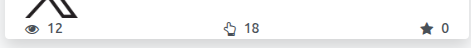

This module brings back into Odoo what an X account already published: the
posts of its timeline, the figures each of them collected, and their comments.

It is the X half of *Social Media Sync*, split from *Social Media X* along the
same line: what a call costs. The connector asks X for a fixed number of
things per account — link it, refresh its card, publish, delete, read the
figures of the publications of the last 30 days, read the single publication
that is being opened — and that number does not change whether the account
published once or ten thousand times. Everything whose cost grows with the
history of the account lives here: the timeline that answers up to a hundred
publications and one download per media not stored yet, and up to five calls
per publication whose comments are read, one per page of the conversation.

An Odoo that only publishes on X installs *Social Media X* alone and pays for
none of it.

Main features:

- Import of the publications of the timeline, with their photos, videos and
  animated GIFs, and of the figures each of them collected, on demand, through the scheduled actions of *Social Media Sync*
  and through the check for updates of *Social Media Base*, which on X
  imports instead of flagging the account.
- Comments of a publication, read from the dashboard: the conversation is
  walked page by page up to a ceiling, and the replies of a comment are nested
  from what was read instead of being asked for apart. A comment answers the
  publication, and answering a comment answers that comment, which on X is a
  post like any other.
- *Recommend* on a publication and on each comment and reply of its thread,
  which gives or withdraws the like of the account on X. Which ones the
  account already liked is read from its latest likes on X, when the account
  is imported and when the thread is opened.
- *Delete* on the comments the account wrote, which deletes them on X: X only
  deletes the posts of the account that asks, so the entry is not offered on
  the comments of other people.
- Reading only what was published after a chosen publication, with *Enable
  since*, for an account that does not need its whole history read again.

Statistics account
-------------------
The figures of the account are the sum of the publications Odoo holds for it.
A publication deleted on X is marked *Deleted* and keeps the figures of the
last read, so it goes on counting; the figures only fall when the record
itself is removed in Odoo.

The figures of the card are the sum of every publication of the account
stored in Odoo, with no window and no ceiling. What the hundred publications
of one timeline page limit is how far back an import reaches, and what the
30-day window of *Social Media X* limits is which publications get their
figures read back from X; anything older keeps the last figures that were
read for it and keeps being counted. Only original publications are stored
and counted: retweets, replies and quotes are discarded on import.

1. The eye icon: Total number of views, which may include multiple views by the same user.
2. The hand icon: the interactions (likes, comments, retweets and quotes) of
   every publication stored for the account, a publication deleted on X
   included, which keeps the figures of the last read. They are the
   [metrics](https://docs.x.com/x-api/fundamentals/metrics) X returns for a post.
3. The star icon: the engagement of the account, the interactions of its
   publications over their impressions. X reports no rate of its own, so it is
   derived from those counters, and it counts the retweets and the quotes as
   interactions like any other.

   

If the X API [rate limit](https://docs.x.com/x-api/fundamentals/rate-limits) is
reached while refreshing the statistics, the last metrics stored on the
account are kept instead of failing.
