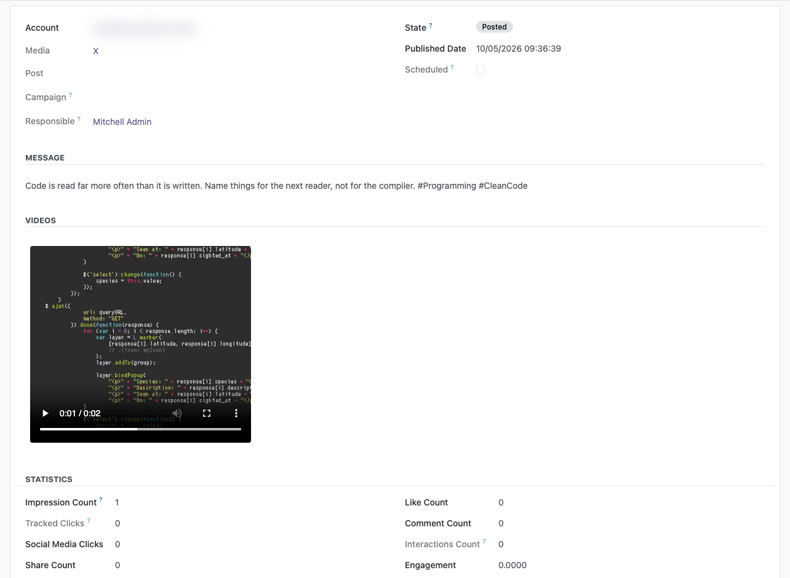
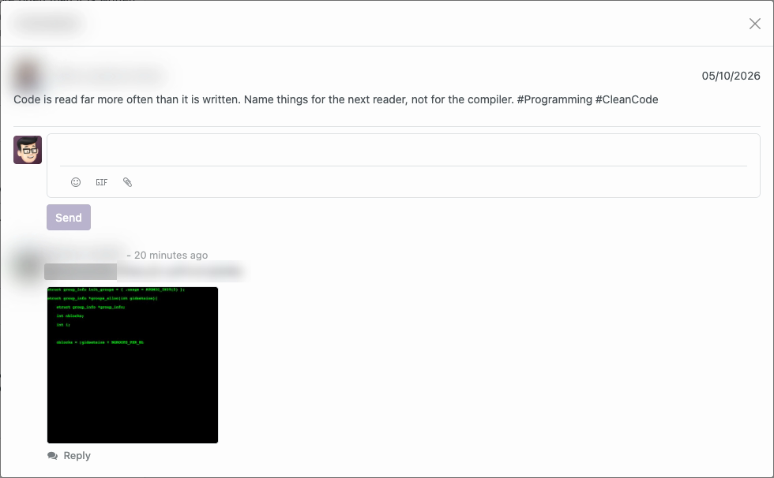
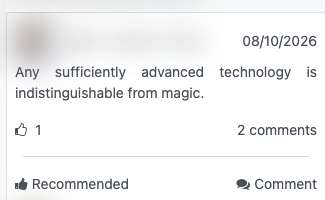
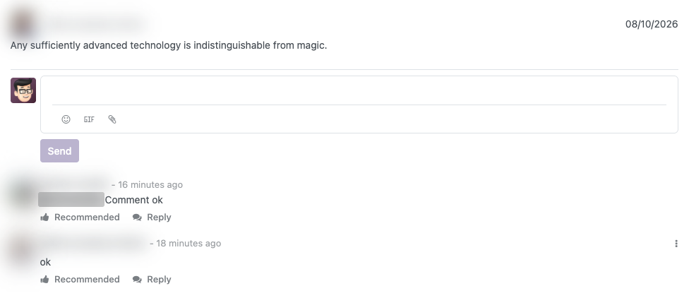
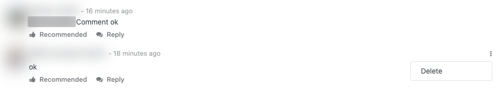

Importing the publications
------------------------

- The timeline of the account is read with
  [the posts of a user](https://docs.x.com/x-api/posts/user-posts-timeline),
  which answers up to **100 publications in a single request** and is not
  paginated: what is older than those hundred is not imported, in order to
  spare the requests of the plan. Retweets and replies are excluded, so only
  the original publications of the account are stored.
- Each media of a publication is downloaded once and stored as an attachment,
  and a media already stored is not asked for again. A photo is downloaded
  from the address X answers with it, and one answered without an address is
  not stored. A video or an animated GIF has no such address: X lists the
  files it serves for it, and the mp4 of the highest quality is the one
  downloaded, which for an animated GIF is the single mp4 X makes of it. The
  card of the publication counts its videos, and its form plays them.

  

- No file above the size cap of *Social Media Sync* is downloaded. The cap
  applies to every file on its own, not to the publication as a whole.
- A video that is not downloaded — X lists no mp4 for it, the download fails
  or the file is above the cap — still leaves the publication marked as
  having a video, and its form says that the video was not downloaded. The
  next pass that reads the publication tries the download again.
- While the system parameter `social_media_sync.download_videos` is `False`,
  no video and no animated GIF is downloaded, and the photos still are. The
  publication is marked as having a video all the same, and its form says
  that the video was not downloaded. The videos already downloaded stay, and
  once the parameter is back to `True` the next import downloads the ones
  missing from the publications it reads.
- The files come from the servers X delivers its media from, not from its
  API, so downloading them spends no credits of the plan.
- The *Update* button of the dashboard runs the same import on demand, over
  every account shown.
- The text of a publication is stored as X wrote it, without the
  `https://t.co/…` link X appends to it for each of its photos, videos or
  animated GIFs, which are stored apart as attachments. The links the author
  wrote, and the one a quote points at, stay in the text.
- The module adds the *With Reposts* and *With Quotes* filters to the search
  panel of the dashboard, next to the filters of impressions and interactions
  of *Social Media Sync*.
- The list of publications of the dashboard offers the *Reposts* and *Quotes*
  columns, right after *Shares*. The list is shared by every social media, so
  both are hidden until they are chosen from the optional columns of the list.
- With *Enable since* the import only asks for what was published after the
  stored publication, so the older publications are no longer read by this
  import. The ones published in the last 30 days are refreshed all the same by
  *Social Media X*, which reads their figures by identifier. The card of the
  account is unaffected either way: the figures are written on each
  publication, and the card adds up every publication stored.

Comments
------------------------

- A comment or a reply written on an X thread may carry images. The composer
  offers the upload, the files travel to X with the reply and are shown on
  the published comment.
- The video or the animated GIF of a reply is shown by its cover, as one more
  image of the comment. It is not played in Odoo: it is watched on X.

  

- The text of a comment read from X is shown the same way as the text of an
  imported publication: without the links X appends for its media, and with
  the links its author wrote.

- The comments of a publication are read with the
  [recent search](https://docs.x.com/x-api/posts/recent-search) endpoint of X,
  which only covers the **last 7 days**: the replies to older publications are
  not shown on the dashboard even though the post has them. Retweets and
  quotes are excluded as well, only the replies are listed.
- The conversation is read a hundred replies at a time, following the token X
  answers with until it runs out or five pages have been read. Read to the
  end, how many replies each comment has is counted in Odoo and never asked to
  X again; cut short by that ceiling or by the limit of requests of the plan,
  no number is stated, and the dashboard offers to unfold the replies of every
  comment.
- Answering a publication and answering one of its comments are the same call
  to X: on X a comment is a post like any other, and what changes is the post
  being replied to.

Recommending and deleting
------------------------

- *Recommend* is offered on the card of every publication of X and on each
  comment and reply of its thread. Pressing it gives the like of the account
  on X, and pressing it on what is already *Recommended* withdraws it. The
  like is always given as the account the publication belongs to.

  

  
- *Delete*, in the menu of a comment, is offered only on the comments the
  account wrote that answer the publication. X only deletes the posts of the
  account that asks, so the comments of other people do not offer it, and a
  reply inside a thread does not offer it either. After a confirmation the
  post is deleted on X and the thread is read again without it. A comment
  already gone from X counts as deleted.

  
- When X refuses the call, its reason is shown instead. An App that cannot
  spend against the API is explained as such, with the link to the pricing of
  X, and credentials X no longer accepts mark the account as needing to be
  authorized again. An error X does not explain on a *Recommend* makes Odoo
  ask about the publication itself, which is marked *Deleted* if it is gone
  from X.

What Odoo sees of the likes
------------------------

- X cannot be asked whether the account liked a given post. What it offers is
  the list of the latest posts the account liked, and Odoo reads a single page
  of it, the **hundred latest**, at two moments: on every import of the
  account, once its timeline has answered, to mark the publications the
  account recommended; and when the dialog of the comments opens, to mark the
  comments and replies.
- A like older than those hundred is not seen: the publication or the
  comment is drawn as not recommended. Pressing *Recommend* there gives a like
  X already holds; X answers that it is given, and the entry is drawn right
  from then on.
- The refresh of the dialog every two minutes, and the reload after a comment
  is sent or deleted, do not read the likes again. The comments already on
  screen keep the like they had, and the new ones arrive not recommended. A
  like given or withdrawn on x.com while the dialog is open is seen the next
  time the dialog opens; on a publication, on the next import.
- The like of a publication is stored on it, and every import writes it again
  on the publications its page of the timeline answers. The like of a comment
  is not stored in Odoo: the dialog reads it again each time it opens.
- A page of likes that cannot be read never stops the import or the
  comments. The import leaves the publications as they were marked, and the
  dialog draws its comments as not recommended.

What it costs
------------------------

- The page of likes is charged by X for every post it answers, up to a
  hundred, and a post read twice in the same day is charged once. It is read
  once per account on every import — the *Update* button, the check for
  updates every two hours, the initial sync and the full resync — and once
  each time the dialog of the comments of a publication opens.
- *Recommend* on a comment is one call to X, and the card is not refreshed
  after it.
- *Recommend* on the card of a publication is one call to X, and then, whether
  X accepted it or not, the card is refreshed the way its *Update* button
  refreshes the account: the figures of the recent publications, the timeline
  and the page of likes.
- *Delete* is one call to X. The thread is then read again, and a deletion X
  accepted refreshes the card the same way *Recommend* does.
- What X charges for each of those calls is on
  [the pricing of the X API](https://docs.x.com/x-api/getting-started/pricing).

What this module does not detect
------------------------

- Its own passes do not detect a publication deleted on X: a publication
  deleted there is marked *Deleted* only by the check *Social Media X* makes
  when the publication is opened.

Rate limits
------------------------

The endpoints this module spends from the plan of the account are the timeline
of the user, the recent search of the comments, the publication of a reply,
the like and its withdrawal, which share one window, the list of the latest
likes of the account and the deletion of a comment. Each of them has its own
window on the account, the same record where
*Social Media X* stores the windows of the endpoints it spends —the read of a
single post and the read of the figures by identifier—, and when X answers
that one is exhausted Odoo stops calling that endpoint until the window
expires.

While the window of the comments lasts, opening the conversation of a
publication shows the notice *The comments could not be read from X. The
account may have reached the limit of requests of its plan.* instead of an
empty thread, and a refresh in that state leaves the comments already on
screen untouched.

While the window of the replies lasts, publishing a comment answers *The
comment could not be published on X. The account may have reached the limit
of requests of its plan.* instead of reporting a reply X never received. The
text of the composer is not kept, but the comment being answered stays aimed
at, so the retry starts under the same comment.

While the window of the likes lasts, *Recommend* answers *The recommendation
could not be sent to X. The account may have reached the limit of requests of
its plan.* and the entry stays as it was drawn. While the window of the
deletion lasts, *Delete* answers *The comment could not be deleted on X. The
account may have reached the limit of requests of its plan.* and the comment
stays. While the window of the list of likes lasts, the import and the dialog
go on without it, as when the page cannot be read.

Uninstalling
------------------------

Uninstalling this module leaves the account linked and able to publish. What
goes with it is the checkpoint of the import: *Enable since*, *Post since* and
the reference of the last publication read.
